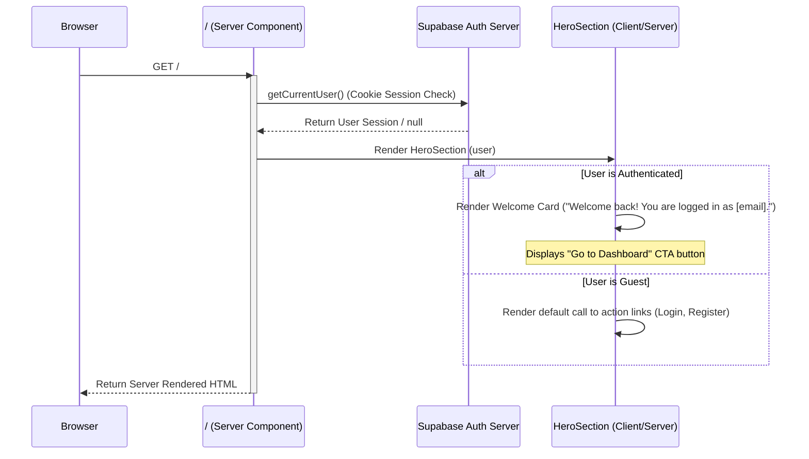

# Architecture Design & Integration Plan: Calculator Dashboard, Navigation Redirections & Batch 2 Runbook Audit

This design document outlines the navigation changes, page-level integration of the currency calculator, landing page session state flows, schema details for Batch 2 security/support updates, and the integration/execution audit for the 13 Batch 2 items.

---

## 1. Navigation Structure Changes

To enrich the authenticated dashboard user experience, the **Currency Calculator** component (previously only accessible on the public landing page) has been integrated directly into the dashboard navigation.

### Updated Route Mappings
- **Dashboard Calculator Sub-page**: `[locale]/(dashboard)/dashboard/calculator`
  - Renders the interactive currency calculator.
  - Locked behind authentication. Inherits the main dashboard layout.
- **Calculator Navigation Link**:
  - Added to the desktop/mobile sidebar constants: `src/constants/sidebar.ts`.
  - Icon: Lucide `Calculator`.
  - Translation key: `Nav.calculator`.
- **Public Landing Page**: `[locale]/(public)/` (unchanged path, but updated layout behaviour).

---

## 2. Layout State & Redirection Flows

### Logo Redirections
The logo (represented by the `Isotipo` component) in all dashboard components has been updated to point to the public landing page (`/`) instead of `/dashboard`. This allows unified back-to-home behavior across both guest and authenticated shells:

- **Dashboard Sidebar**: `src/components/layout/sidebar.tsx`
  - Link wrapping `<Isotipo width={100} height={100} />` modified to `href="/"`.
- **Dashboard Mobile Menu Header**: `src/components/layout/header.tsx`
  - Link wrapping `<Isotipo width={40} height={40} />` inside the mobile navigation menu modified to `href="/"`.

### Session-Aware Landing Page Flow
The landing page hero has been updated to render an elegant welcome back card when the active user has a valid authenticated session. This ensures seamless movement between marketing/educational content and the user application.

#### Flow Diagram


#### Server/Client Hydration Safety
Because authentication status is determined on the server using `getCurrentUser()` inside `src/app/[locale]/(public)/page.tsx` (a React Server Component) and passed as a prop to the React Server/Client tree, the rendered HTML is identical between client and server. This avoids any runtime hydration mismatches (which typically occur when checking client-side storage or `window` objects during initial mount).

---

## 3. Database Schema Modifications (Batch 2)

Batch 2 introduces audit-logging and feedback-intake mechanisms requiring new database tables and RLS permissions.

### `login_events` Table (Item #4)
Tracks user authentication activity and failed sign-in thresholds for suspicious-activity alerts.

```sql
CREATE TABLE public.login_events (
    id UUID DEFAULT gen_random_uuid() PRIMARY KEY,
    user_id UUID REFERENCES auth.users(id) ON DELETE CASCADE NOT NULL,
    event_type TEXT NOT NULL CHECK (event_type IN (
        'sign_in',
        'failed_attempt',
        'password_change',
        'security_action'
    )),
    ip_address TEXT,
    country_code TEXT,            -- ISO 3166-1 alpha-2
    user_agent TEXT,
    is_suspicious BOOLEAN DEFAULT FALSE,
    reason TEXT,                  -- e.g., 'new_country', 'failed_attempt_threshold'
    metadata JSONB,               -- additional context (e.g., previous_country)
    created_at TIMESTAMPTZ DEFAULT NOW()
);

-- Optimization Indexes
CREATE INDEX idx_login_events_user_created ON public.login_events(user_id, created_at DESC);
CREATE INDEX idx_login_events_ip_created ON public.login_events(ip_address, created_at DESC) WHERE event_type = 'failed_attempt';
CREATE INDEX idx_login_events_user_event ON public.login_events(user_id, event_type, created_at DESC);

-- RLS Enforcement
ALTER TABLE public.login_events ENABLE ROW LEVEL SECURITY;

CREATE POLICY "Users can view own login events"
    ON public.login_events FOR SELECT
    USING (auth.uid() = user_id);

-- NOTE: Inserts, Updates, and Deletes are restricted to the service role (no client-side write policy).
```

### `support_tickets` Table (Item #12)
Captures and tracks customer support queries safely.

```sql
CREATE TABLE public.support_tickets (
    id UUID DEFAULT gen_random_uuid() PRIMARY KEY,
    user_id UUID REFERENCES auth.users(id) ON DELETE SET NULL,
    name TEXT NOT NULL,
    email TEXT NOT NULL,
    subject TEXT NOT NULL,
    message TEXT NOT NULL,
    ip_address TEXT,
    user_agent TEXT,
    status TEXT NOT NULL DEFAULT 'open' CHECK (status IN (
        'open',
        'in_progress',
        'resolved',
        'spam'
    )),
    locale VARCHAR(5),
    created_at TIMESTAMPTZ DEFAULT NOW(),
    updated_at TIMESTAMPTZ DEFAULT NOW()
);

-- Optimization Indexes
CREATE INDEX idx_support_tickets_status_created ON public.support_tickets(status, created_at DESC);
CREATE INDEX idx_support_tickets_ip_created ON public.support_tickets(ip_address, created_at DESC);

-- RLS Enforcement
ALTER TABLE public.support_tickets ENABLE ROW LEVEL SECURITY;

-- NOTE: Users do not have read access (no SELECT policy).
-- Writes are performed via Server Actions utilizing the service role.
```

---

## 4. Batch 2 Runbook Audit & Integration Map

The codebase is audited against the 13 runbook items defined in `docs/plan/16-implementation-runbook.md`.

| Runbook Item # | Feature Name | Target Branch | Status | Integration Details & Commit Info |
|---|---|---|---|---|
| **1** | Git Convention | `chore/13-git-conventions` | **Completed** | Commit `d6c75f9` - Configures Conventional Commits rules in `CLAUDE.md`. |
| **2** | Duplicate forgot-password link | `fix/03-duplicate-forgot-password` | **Completed** | Commit `482e248` - Sets `showLinks={false}` on the `<Auth>` wrapper to eliminate duplication. |
| **3** | Avatar in Header | `fix/06-avatar-header` | **Completed** | Commit `ace1039` - Replaces static initials layout with `<AvatarImage>` rendering. |
| **4** | Budget Circle Clipping | `fix/07-budget-circle-overflow` | **Completed** | Commit `8966809` - Removes layout-clipping CSS `overflow-hidden` classes from KPI components. |
| **5** | OWASP compliance | `feat/05-owasp-headers` | **Completed** | Commits `ffe96d8` to `0a978de` - Adds HTTP security headers, cookie flags, and RLS delete policy improvements. |
| **6** | Email branding | `feat/01-email-branding` | **Completed** | Commits `cfd475f` to `93ccbbd` - Configures Resend SMTP, integrates branded templates, and sets standard headers. |
| **7** | Password-reset rate limit | `feat/02-reset-rate-limit` | **Pending** | Needs cooldown state & timer logic on forgot password forms. |
| **8** | Suspicious activity emails | `feat/04-suspicious-activity` | **Pending** | Needs migration (login_events), custom sign-in heuristics, alert email triggers. |
| **9** | Money math (Dinero.js) | `refactor/09-money-math-dinero` | **Pending** | Needs Dinero.js dependency installation, refactoring calculators, and unit tests. |
| **10** | Rates async | `perf/10-rates-async` | **Pending** | Needs `useTransition` hooks in chart navigation to decouple network fetches. |
| **11** | Expenses redesign | `feat/08-expenses-redesign` | **Pending** | Needs sidebar column layouts, restructured KPI states, and illustration cards. |
| **12** | Support system | `feat/12-support-system` | **Pending** | Needs migration (support_tickets), Turnstile verification, and ticket pages. |
| **13** | Onboarding AI | `feat/11-onboarding-ai` | **Pending** | Needs AI onboarding modal steps, LLM action hooks, and layout integration. |
