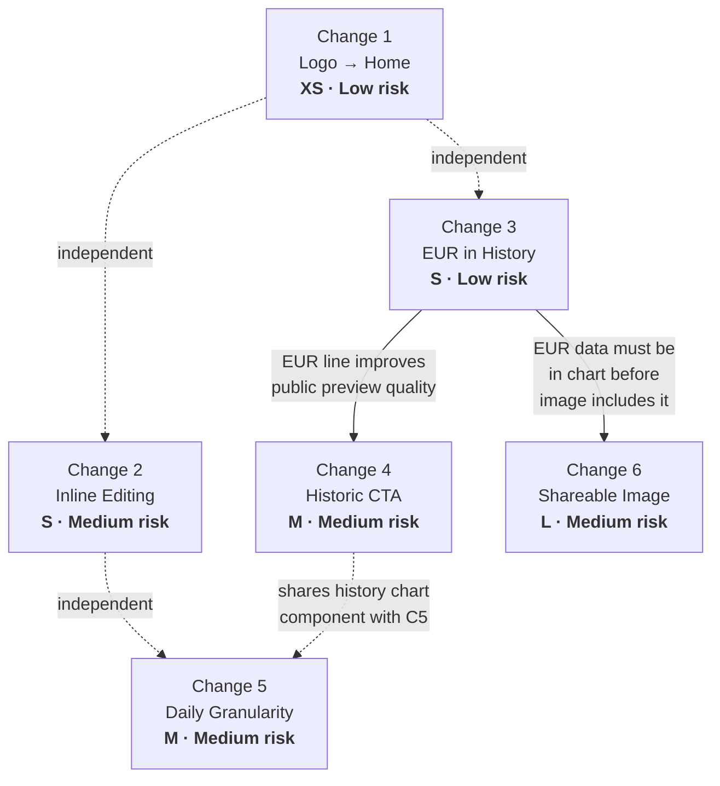

# Phase 2 — Feature Specs & Acceptance Criteria

---

## Change 1 — Logo → Home

**User story:** As any user (public or authenticated), I want to click the Fin logo and be taken to the appropriate home page, so that I always have a reliable escape hatch from wherever I am in the app.

### Scope

**In:**
- Public landing header logo → `/` (localized via next-intl `Link`)
- Dashboard sidebar logo (desktop) → `/dashboard`
- Dashboard mobile header logo → `/dashboard`

**Out:**
- Scroll-to-top behavior (Next.js re-navigating to the same route already resets scroll)
- Logo in the mobile sheet menu of the public header (it is branding-only, not interactive, and already centered for aesthetics)
- Any animation or hover effect beyond what the Link element provides

### UX behavior

1. **Public landing page (desktop):** User clicks the `Isotipo` logo in the top-left of the header → navigates to `/{locale}` (the landing page root). If already on the landing page, the page reloads to the top.
2. **Public landing page (mobile):** Logo in the main header (not inside the sheet) → same as above.
3. **Dashboard (desktop sidebar):** User clicks the `Isotipo` logo in the sidebar header → navigates to `/{locale}/dashboard`.
4. **Dashboard (mobile header):** User clicks the `Isotipo` logo in the dashboard top header → navigates to `/{locale}/dashboard`.

**Edge cases:**
- Already on landing page: Link navigation produces a no-op scroll-reset (acceptable).
- Already on dashboard: Same behavior (acceptable).
- Locale changes: next-intl `Link` auto-prefixes the correct locale — no manual `useLocale()` needed.

### i18n strings needed

None. This change is navigation only.

### Technical approach

**Files to touch:**
- `src/components/public/header.tsx:20` — replace `import Link from "next/link"` usage for the logo with the next-intl `Link` from `@/i18n/navigation.ts`; keep `href="/"` (next-intl's `Link` will localize it automatically).
- `src/components/layout/sidebar.tsx:43-47` — wrap the `<Isotipo>` in a `<Link href="/dashboard">` from `@/i18n/navigation.ts`; add appropriate hover/focus styles to make it feel clickable.
- `src/components/layout/header.tsx:58-60` — wrap the `<Isotipo>` in a `<Link href="/dashboard">` from `@/i18n/navigation.ts`.

**New files:** None.

**New dependencies:** None. `@/i18n/navigation.ts` already exports a localized `Link`.

**Data model changes:** None.

**Server vs client:** All three files are already `"use client"`. No boundary change needed.

**Auth/RLS:** None.

### Acceptance criteria

- [ ] Clicking the logo on the public landing page (desktop) navigates to `/{locale}`.
- [ ] Clicking the logo on the public landing page (mobile, main header) navigates to `/{locale}`.
- [ ] Clicking the logo in the dashboard sidebar navigates to `/{locale}/dashboard`.
- [ ] Clicking the logo in the dashboard mobile header navigates to `/{locale}/dashboard`.
- [ ] All logo links have visible focus rings (accessibility).
- [ ] No extra middleware redirect hop for the public logo (next-intl `Link` generates `/{locale}` directly).

### Test plan

**Unit:** Not applicable (pure navigation, no logic).

**Manual QA:**
1. Open `/{locale}` → click logo → confirm URL stays `/{locale}`.
2. Open `/{locale}/rates` → use dashboard sidebar logo → confirm redirect to `/{locale}/dashboard`.
3. Open `/{locale}/dashboard` → use mobile header logo → confirm redirect to `/{locale}/dashboard`.
4. Check Network tab: public logo link should produce a direct `200` to `/{locale}`, not a `307` redirect.
5. Tab to logo links; confirm focus ring is visible.

**Effort:** XS — two `<Link>` wraps and one import swap. ~30 minutes.

**Risk:** Low. Pure navigation change, no state or data.

---

## Change 2 — Inline Bidirectional Amount Editing

**User story:** As a visitor on the landing page, I want to type an amount in either the "from" or "to" currency field and see the other field update instantly, so that I can calculate conversions in either direction without clicking a swap button.

### Scope

**In:**
- Both `CurrencyCalculator` input fields become editable.
- Typing in one field recomputes the other in real time.
- Swap button is retained; clicking it flips the currency labels (and direction state), recomputing both fields based on the current "from" value.
- EUR, USD, USDT all supported (already are, no change to currency list).

**Out:**
- Copy button behavior (unchanged).
- Rate source label behavior (unchanged).
- Any animation between the two fields.
- Keyboard shortcut for swap.

### UX behavior

1. User opens the landing page. The calculator shows two fields: top = selected currency (e.g., USD), bottom = Bs.
2. User types `50` in the top field → bottom field immediately shows `50 × rate` in Bs.
3. User types `100` in the bottom (Bs) field → top field immediately shows `100 / rate` in the selected currency.
4. User clicks the swap button → the currency labels flip (top becomes Bs, bottom becomes the selected currency); the top field retains its numeric value; the bottom field recomputes.
5. User changes the currency selector (e.g., USD → EUR) → both fields update using the new rate; the "from" field's value is preserved.

**Edge cases:**
- User clears a field (empty string): the other field shows `0` or `""` (do not show `NaN`).
- User types a non-numeric character: ignore (HTML `type="number"` handles this natively, but the "to" field uses `type="text"` — add a numeric guard on `onChange`).
- Rate is `0` (EUR missing from DB): division-by-zero guard → show `0` in result, do not crash.
- Very large numbers: JS `Number` precision is sufficient for bolivar amounts up to 10^15.

### i18n strings needed

None. No new user-facing text. The existing `Landing.currency`, `Landing.usd`, `Landing.usdt`, `Landing.eur`, `Landing.copy`, `Landing.copied` strings are sufficient.

### Technical approach

**Files to touch:**
- `src/components/landing/currency-calculator.tsx` — full state refactor (see below).

**New files:** None.

**New dependencies:** None.

**State refactor:**

Replace the current single `amount: string` state with:
- `fromAmount: string` — value in the "from" field (always the top field)
- `toAmount: string` — value in the "to" field (always the bottom field)
- Remove the `result: number` state (computed inline from `fromAmount` or `toAmount`).
- Retain `currency: CurrencyPair` and `direction: "toBs" | "fromBs"` (direction controls which currency is on top).

**Two-way sync logic (no circular effect):**

```
handleFromChange(val):
  setFromAmount(val)
  const n = parseFloat(val) || 0
  const rate = getRateForCurrency(currency)
  if direction === "toBs":  setToAmount((n * rate).toFixed(2))
  else:                     setToAmount(rate > 0 ? (n / rate).toFixed(2) : "0")

handleToChange(val):
  setToAmount(val)
  const n = parseFloat(val) || 0
  const rate = getRateForCurrency(currency)
  if direction === "toBs":  setFromAmount(rate > 0 ? (n / rate).toFixed(2) : "0")
  else:                     setFromAmount((n * rate).toFixed(2))
```

Each handler sets both states directly — no `useEffect` needed to sync, no circular dependency.

**Swap button behavior:**

```
toggleDirection():
  setDirection(prev => prev === "toBs" ? "fromBs" : "toBs")
  // Recompute toAmount from current fromAmount under the new direction
  // (useEffect watching [direction, fromAmount, currency] handles this)
```

A single `useEffect([currency, direction])` recalculates `toAmount` from `fromAmount` whenever either changes — this handles both currency-selector changes and swap-button clicks without introducing circular effects (it only writes `toAmount`, not `fromAmount`).

**Server vs client:** Already `"use client"`. No change.

**Auth/RLS:** None.

### Acceptance criteria

- [ ] Typing a number in the top (from) field instantly updates the bottom (to) field.
- [ ] Typing a number in the bottom (to) field instantly updates the top (from) field.
- [ ] Clearing either field shows `""` or `"0"` in the other (no NaN).
- [ ] Clicking swap flips the currency labels and recomputes values correctly.
- [ ] Changing the currency selector (USD → EUR → USDT) recomputes both fields without clearing them.
- [ ] When EUR rate is 0 (DB missing), no crash; result shows `0`.
- [ ] Copy button still copies the correct bottom-field value.
- [ ] Rate info line below still shows `1 {currency} = Bs. {rate}`.

### Test plan

**Unit:** Test `handleFromChange` and `handleToChange` with known rates:
- USD rate = 50: input `2` in from → to should be `100.00`
- Input `100` in to → from should be `2.00`
- Input `""` → other shows `0.00`

**Manual QA:**
1. Type in from field → confirm to updates.
2. Type in to field → confirm from updates.
3. Swap → confirm labels flip, values stay consistent.
4. Change currency → confirm re-calculation.
5. Test with EUR (third currency).

**Effort:** S — 2–3 hours. The logic is simple; the risk is the interaction between the swap effect and the direct-set handlers.

**Risk:** Medium. Bidirectional sync in React requires careful sequencing of state updates. Mitigated by the "each handler sets both states directly" pattern — no `useEffect` chain.

---

## Change 3 — EUR Line in Rate History Chart

**User story:** As an authenticated user on the Rates page, I want to see the EUR/VES rate history alongside USD and USDT in the monthly chart, so that I can understand how Euro fluctuations compare with the official USD rate.

### Scope

**In:**
- `RateHistoryPoint` type gains `eur: number | null`.
- `getMonthlyRateHistory()` fetches `EUR_VES` from the DB and populates `eur` per day.
- `RatesHistoryChart` renders a third line for EUR in orange/amber.
- `connectNulls={true}` on all three lines (gaps are bridged).

**Out:**
- EUR in the daily intraday chart (that is Change 5 — it will pick up EUR naturally from the updated type).
- EUR in the public preview chart (Change 4 — it will pick up EUR from the same action).
- Any change to how EUR data is fetched from the external API (already works via `dolarvzla.com`).

### UX behavior

1. User opens `/rates`. The history chart shows three colored lines: blue (USD), green (USDT), amber/orange (EUR).
2. Legend at the bottom shows all three labels.
3. The month selector works identically to before.
4. On days when EUR was not stored (early dates or API outage days), the line bridges across the gap (`connectNulls`).
5. Y-axis domain recalculates to accommodate EUR values (which may differ from USD/USDT by ~10–15%).

### i18n strings needed

| Key | EN | ES |
|---|---|---|
| `Rates.eur_bcv` | `EUR (BCV Official)` | `EUR (BCV Oficial)` |

### Technical approach

**Files to touch:**
- `src/actions/rates.ts`:
  - `RateHistoryPoint` interface: add `eur: number | null`
  - `getMonthlyRateHistory()`: add `"EUR_VES"` to the `.in("pair", [...])` array; initialize `dayMap` entries with `eur: null`; populate `dayData.eur` in the merge loop.
- `src/components/rates/rates-history-chart.tsx`:
  - Update `validRates` domain calculation to include `d.eur`.
  - Add `<Line dataKey="eur" name={t("eur_bcv")} stroke="#f59e0b" strokeWidth={2} dot={{ r: 3 }} activeDot={{ r: 5 }} connectNulls />`.

**New files:** None.

**New dependencies:** None.

**Data model changes:** `RateHistoryPoint` type only (TypeScript interface, no DB change). The `EUR_VES` data is already being written to `exchange_rates`.

**Server vs client:** `getMonthlyRateHistory` is a server action. `RatesHistoryChart` is already client-side. No boundary change.

**Auth/RLS:** `exchange_rates` is readable by authenticated users (existing RLS policy). No change needed.

### Acceptance criteria

- [ ] EUR line appears in the monthly history chart.
- [ ] EUR line color is amber/orange, distinct from blue (USD) and green (USDT).
- [ ] Legend shows all three entries.
- [ ] Y-axis domain accommodates the range of all three rates.
- [ ] On days with no EUR data, the line connects across the gap (no broken segments).
- [ ] Switching months updates all three lines.
- [ ] TypeScript compiles without error (no `eur` field missing from any usage of `RateHistoryPoint`).

### Test plan

**Manual QA:**
1. Navigate to `/rates` — confirm three lines visible.
2. Check a month where EUR data exists (current month) — all three lines have data.
3. Check an older month where EUR may be sparse — EUR line bridges gaps, others unaffected.
4. Run `tsc --noEmit` — no type errors.

**Effort:** S — 1–2 hours. Pure data + rendering addition.

**Risk:** Low. Additive change, no existing behavior modified.

---

## Change 4 — Public Rate History Preview + Signup CTA

**User story:** As an unauthenticated visitor on the landing page, I want to see a preview of the rate history chart and be invited to sign in for full access, so that I understand the value of creating an account before committing.

### Scope

**In:**
- A new read-only "last 30 days" rate history chart section on the landing page (Server Component, no controls).
- A "Sign in to explore full history →" CTA button below or overlaid on the chart, linking to `/{locale}/login`.
- A new server action `getLastNDaysRateHistory(days: number)` that works for anon users.
- A new `PublicRatesHistoryChart` component (simplified, no month selector, no date controls).

**Out:**
- Deep linking to `/rates` (the full in-app view). Unauthenticated users who reach `/rates` are already redirected to login by `requireUser()`.
- Modifying the existing `RatesHistoryChart` component (separate component for public preview).
- Changing the post-signup redirect (the user confirmed they want `/dashboard` after signup — current behavior, no code change).
- Adding a login CTA to the existing `CTASection` (it stays focused on sign-up; the history section has its own CTA).

### UX behavior

1. Visitor scrolls down on the landing page, past the calculator and rate cards.
2. A new section appears: "Rate History" heading, followed by a line chart showing the last 30 days of USD, USDT, and EUR rates (no interactive controls — date selector is hidden).
3. Below or overlapping the chart (bottom overlay recommended — semi-transparent gradient over the bottom 30% of the chart): a card reading "Sign in to explore the full history, filter by date, and track trends over time" with a "Sign In" button.
4. Clicking "Sign In" navigates to `/{locale}/login`.

**Edge cases:**
- No data (new deployment, empty DB): chart area shows a placeholder "No rate data available yet."
- Partial data (fewer than 30 days in DB): chart renders whatever data exists; no error.
- Anon access to `exchange_rates`: RLS already allows anon `SELECT` — no change needed.

### i18n strings needed

| Key | EN | ES |
|---|---|---|
| `Landing.history.title` | `Rate History (Last 30 Days)` | `Historial de Tasas (Últimos 30 días)` |
| `Landing.history.preview_cta` | `Sign in to explore the full history` | `Inicia sesión para explorar el historial completo` |
| `Landing.history.preview_cta_description` | `Filter by date, track trends, and access full rate data.` | `Filtra por fecha, sigue tendencias y accede a todos los datos.` |
| `Landing.history.sign_in` | `Sign In` | `Iniciar sesión` |
| `Landing.history.no_data` | `No rate data available yet.` | `No hay datos de tasas disponibles aún.` |

### Technical approach

**Files to touch:**
- `src/actions/rates.ts` — new exported function `getLastNDaysRateHistory(days: number): Promise<RateHistoryPoint[]>`. Fetches the last `days` calendar days of `USD_VES`, `USDT_VES`, `EUR_VES` from `exchange_rates`, returns one point per calendar day (same aggregation logic as `getMonthlyRateHistory`, but date-range based).
- `src/app/[locale]/(public)/page.tsx` — call `getLastNDaysRateHistory(30)` and pass data to the new section.

**New files:**
- `src/components/public/public-rates-history-chart.tsx` — Client component. Renders a `ResponsiveContainer → LineChart` with three lines (USD, USDT, EUR). No controls. Props: `data: RateHistoryPoint[]`. `connectNulls` on all lines.
- `src/components/public/history-preview-section.tsx` — Server component. Renders: heading, `<PublicRatesHistoryChart>` (as a child), and a bottom-of-chart overlay with the sign-in CTA.

**New dependencies:** None.

**Data model changes:** None. Uses the updated `RateHistoryPoint` type from Change 3.

**Server vs client:**
- `getLastNDaysRateHistory` is a Server Action (already on server).
- `PublicRatesHistoryChart` must be `"use client"` (Recharts requires client).
- `HistoryPreviewSection` is a Server Component that imports the chart as a child.

**Auth/RLS:**
- RLS: `exchange_rates` allows anon `SELECT` — confirmed by migration `20260126190000_fix_exchange_rates_rls.sql`. No change needed.
- `getLastNDaysRateHistory` uses `createClient()` which works with the anon session on the landing page.

**[ASSUMPTION]** The `createClient()` call in `getLastNDaysRateHistory` will use the anon key when called from the landing page (no authenticated session cookie). This is correct per the existing RLS policy.

### Acceptance criteria

- [ ] Landing page shows a "Rate History" section with a line chart of the last 30 days.
- [ ] Chart shows up to three lines: USD (blue), USDT (green), EUR (amber).
- [ ] No interactive controls (month picker, date picker) are visible to unauthenticated users.
- [ ] A "Sign In" CTA is visible on or below the chart.
- [ ] Clicking "Sign In" navigates to `/{locale}/login`.
- [ ] When the DB has no rate data, the section shows a "No data available" message instead of a broken chart.
- [ ] The chart renders correctly at mobile widths (same responsive container as other charts).
- [ ] TypeScript and lint pass.

### Test plan

**Manual QA:**
1. Open landing page while logged out — confirm history section appears.
2. Confirm "Sign In" button navigates to login page.
3. Confirm no console errors related to auth or RLS.
4. Simulate empty DB (or mock): confirm placeholder renders.
5. Check mobile (375px) — chart is usable.

**Effort:** M — 4–6 hours. New action, new components, landing page integration.

**Risk:** Medium. The anon-access assumption must be verified in a real environment. Landing page performance: `getLastNDaysRateHistory` adds a DB query to the landing page Server Component — this should be parallelized with `getExchangeRates()` using `Promise.all`.

---

## Change 5 — Daily (Intraday) Granularity for USDT

**User story:** As an authenticated user on the Rates page, I want to select a specific day and see how the USDT/VES rate evolved throughout that day, so that I can identify the best time to convert.

### Scope

**In:**
- A "Daily" mode toggle in the history chart card (alongside the existing "Monthly" mode).
- In Daily mode: a date picker defaults to today; chart shows all raw `exchange_rates` records for `USDT_VES` (and `USD_VES`, `EUR_VES` as secondary lines) for the selected day, with an HH:mm X-axis.
- New server action `getDailyRateHistory(date: string)` returning `DailyRatePoint[]`.
- URL reflects mode: `?granularity=day&date=YYYY-MM-DD`.
- New Supabase migration: composite index on `(pair, fetched_at)`.

**Out:**
- Intraday data for BTC (not stored per-minute, not relevant).
- Aggregation (min/max/avg per hour) — show raw points only.
- Changing the monthly chart behavior.

### UX behavior

1. User is on `/rates`. The history card has a segmented control or tabs: **Monthly | Daily**.
2. Default: Monthly (current behavior unchanged).
3. User clicks "Daily":
   - Month selector hides; a date picker appears (defaults to today's date).
   - Chart X-axis switches to HH:mm format (e.g., "09:30", "14:00").
   - Chart shows all data points for the selected day — typically up to ~288 for USDT (5-min Binance intervals), fewer for USD/EUR (1-hour BCV intervals).
   - USDT line will be the densest; USD/EUR lines will have sparse points (connected across gaps).
   - If the selected day has no data: "No rate data for this date."
4. User changes the date → chart updates (URL updates → server re-fetches).
5. User clicks "Monthly" → returns to monthly view; date selector hides, month selector reappears.

**Edge cases:**
- Future date selected: no data → "No data" message.
- Date before first `exchange_rates` record in DB: no data → "No data" message.
- Today with only a few hours of data (early morning): chart shows partial day.
- Very many data points (>500): Recharts handles this fine at the chart level; X-axis may tick every N hours to avoid label overlap (use `interval` prop).

### i18n strings needed

| Key | EN | ES |
|---|---|---|
| `Rates.granularity_monthly` | `Monthly` | `Mensual` |
| `Rates.granularity_daily` | `Daily` | `Diario` |
| `Rates.pick_date` | `Pick a date` | `Seleccionar fecha` |
| `Rates.no_data_for_date` | `No rate data for this date.` | `Sin datos de tasa para esta fecha.` |
| `Rates.daily_trend` | `Daily Rate Trend` | `Tendencia Diaria de Tasas` |

### Technical approach

**Files to touch:**
- `src/actions/rates.ts` — new exported type `DailyRatePoint` and function `getDailyRateHistory(date: string)`:
  - Parses `date` as `YYYY-MM-DD`.
  - Queries `exchange_rates` for `pair IN ("USDT_VES", "USD_VES", "EUR_VES")` where `fetched_at` is between `startOfDay` and `endOfDay` (in UTC, being careful with timezone).
  - Returns records sorted by `fetched_at ASC`, each as `{ time: "HH:mm", usdt: number | null, usd: number | null, eur: number | null }`.
- `src/app/[locale]/(dashboard)/rates/page.tsx` — read `granularity` and `date` search params; conditionally call `getDailyRateHistory(date)` or `getMonthlyRateHistory(year, month)`.
- `src/components/rates/rates-history-chart.tsx` — add granularity toggle (tabs/segmented), date picker (reuse `react-day-picker`'s `DayPicker` in popover or simple `<input type="date">`), conditional rendering of monthly vs daily chart, HH:mm X-axis formatter for daily mode.

**New files:** None (all changes in existing files).

**New dependencies:** None. `react-day-picker` is already installed.

**New Supabase migration:**
```sql
-- Improves performance of pair+date range queries used by getDailyRateHistory
CREATE INDEX IF NOT EXISTS idx_exchange_rates_pair_fetched
  ON public.exchange_rates (pair, fetched_at DESC);
```

**Server vs client:**
- `getDailyRateHistory` is a Server Action.
- The page component reads search params server-side and passes data to `RatesHistoryChart`.
- `RatesHistoryChart` (client) handles the toggle, date picker, and URL update via `router.replace`.

**Auth/RLS:** Authenticated-only page (`requireUser()` in layout). No RLS change.

**[ASSUMPTION]** The DB stores `fetched_at` in UTC. The date picker will operate in the user's local timezone. The action will need to convert the local date string to a UTC range (`00:00:00Z` to `23:59:59Z`). A discrepancy of up to 12 hours is possible for users in extreme timezones — acceptable for this use case.

### Acceptance criteria

- [ ] "Monthly | Daily" toggle appears in the history chart card header.
- [ ] Monthly mode is the default and unchanged from current behavior.
- [ ] Switching to Daily mode shows a date picker defaulting to today.
- [ ] Selecting a date with data shows a chart with all records for that day, HH:mm X-axis.
- [ ] USDT line shows the most points (5-min intervals from Binance).
- [ ] USD and EUR lines show fewer points, connected across gaps.
- [ ] Selecting a date with no data shows "No rate data for this date."
- [ ] URL reflects `?granularity=day&date=YYYY-MM-DD` when in Daily mode.
- [ ] Switching back to Monthly mode restores the month selector.
- [ ] The new DB index migration applies cleanly.
- [ ] TypeScript compiles without error on the new `DailyRatePoint` type.

### Test plan

**Unit:**
- `getDailyRateHistory("2026-05-06")` with seed data → returns correctly shaped array with time strings.

**Manual QA:**
1. Switch to Daily → confirm date picker appears, defaults to today.
2. Select a day with USDT data → confirm dense USDT line; check HH:mm axis labels.
3. Select a day before the app launched → confirm "No data" state.
4. Navigate browser back → confirm URL state is preserved.
5. Run `supabase db push` (local) with the new migration → confirm no error.

**Effort:** M — 1–2 days. New action, migration, chart mode, date picker integration.

**Risk:** Medium. Timezone handling (local vs UTC) in the date query. Recharts X-axis label density with 200+ points (use `interval="preserveStartEnd"` or calculate a tick interval).

---

## Change 6 — Shareable Rates Image

**User story:** As an authenticated user on the Rates page, I want to generate and share a branded image of the day's rates, so that I can quickly inform my contacts of current exchange rates without manually typing them.

### Scope

**In:**
- A "Share Rates" button on the `/rates` page (authenticated only).
- A dialog (modal) with two steps:
  1. Select which rate pairs to include (checkboxes: USDT/VES, USD/VES, EUR/VES — default all checked).
  2. Select target platform (WhatsApp/General = 1:1 square, Twitter/X = 16:9, Instagram Story = 9:16 portrait).
- A hidden branded image template (React `div`) rendered off-screen.
- `html-to-image` (lazy-loaded) captures the template as a PNG.
- `navigator.share({ files: [pngFile] })` opens the native share sheet; if unavailable, falls back to `<a download>`.

**Out:**
- Share button on the public landing page (authenticated `/rates` only, per user decision).
- BTC/USD or BTC/USDT in the image (only USDT, USD, EUR).
- Server-side image generation.
- Animated/video sharing.

### UX behavior

1. User is on `/rates`. A "Share Rates" button appears in the page header area (near `RatesTitle`).
2. Clicking opens a `Dialog`:
   - **Step 1 — Select rates:** Three checkboxes: USDT/VES ✓, USD/VES ✓, EUR/VES ✓ (all checked by default). User can uncheck any.
   - **Step 2 — Select platform:** Three option cards with icons:
     - "WhatsApp / General" (square 1:1)
     - "Twitter / X" (landscape 16:9)
     - "Instagram Story" (portrait 9:16)
   - A "Generate & Share" primary button.
3. User clicks "Generate & Share":
   - Button shows loading state ("Generating…").
   - The hidden image template is rendered with the selected pairs and current rates.
   - `html-to-image.toPng()` captures it.
   - If `navigator.share` is available and supports files: opens native share sheet.
   - If not (desktop browser): triggers a file download (`rates-YYYY-MM-DD.png`).
4. Success: dialog closes (or stays open for another share).

**Edge cases:**
- User unchecks all pairs: "Generate & Share" is disabled with tooltip "Select at least one rate."
- `html-to-image` throws (e.g., CORS on SVG assets): show a Sonner toast error "Could not generate image. Please try again."
- Rate data is stale: image shows whatever is in the current `rates` prop — always reflects what the user sees on screen.
- Mobile Safari: `navigator.share` is available and supports files — happy path. If file sharing not supported, fall back to download.

### i18n strings needed

| Key | EN | ES |
|---|---|---|
| `Rates.share_rates` | `Share Rates` | `Compartir Tasas` |
| `Rates.share_dialog_title` | `Share Today's Rates` | `Compartir Tasas de Hoy` |
| `Rates.share_step_rates` | `Select rates to include` | `Selecciona las tasas a incluir` |
| `Rates.share_step_platform` | `Select sharing format` | `Selecciona el formato` |
| `Rates.share_platform_general` | `WhatsApp / General` | `WhatsApp / General` |
| `Rates.share_platform_twitter` | `Twitter / X` | `Twitter / X` |
| `Rates.share_platform_story` | `Instagram Story` | `Instagram Story` |
| `Rates.share_generate` | `Generate & Share` | `Generar y Compartir` |
| `Rates.share_generating` | `Generating…` | `Generando…` |
| `Rates.share_error` | `Could not generate image. Please try again.` | `No se pudo generar la imagen. Inténtalo de nuevo.` |
| `Rates.share_select_at_least_one` | `Select at least one rate` | `Selecciona al menos una tasa` |

### Technical approach

**Files to touch:**
- `src/app/[locale]/(dashboard)/rates/page.tsx` — pass `rates` data down to a new `ShareRatesButton` component (or use a client wrapper).
- `src/components/rates/rates-title.tsx` — add `ShareRatesButton` to the title area.

**New files:**
- `src/components/rates/share-rates-button.tsx` — `"use client"` component. Contains the Dialog, checkboxes, platform selector, and generation logic. Lazy-imports `html-to-image`.
- `src/components/rates/share-rates-image-template.tsx` — `"use client"` component. A styled `div` (fixed dimensions, off-screen via `position: absolute; left: -9999px`) used as the capture target. Renders: Fin logo (from `/public/isologo.svg`), rate rows for selected pairs, date, `fin.app` (or the actual URL).

**New dependencies:**
- `html-to-image` — ~30KB gzip. Justification: purpose-built for React component → PNG conversion; `dom-to-image-more` is unmaintained; `satori` requires server-side rendering and a separate font-loading pipeline. Lazy-loaded (`await import('html-to-image')`) so it does not increase the initial page bundle.

**Data model changes:** None. Image uses the `RateData[]` already passed to the rates page.

**Server vs client:**
- `ShareRatesButton` and `ShareRatesImageTemplate` are `"use client"`.
- The template div must be mounted in the DOM when capture runs — use a React `ref` on a hidden wrapper rendered alongside the button.

**Auth/RLS:** `/rates` is already auth-gated via `requireUser()` in layout. No additional RLS consideration.

**Image template spec:**
- Fin logo (top left): `/public/isologo.svg` via `` tag (not Next.js `Image` — `html-to-image` may not handle the Next.js image proxy correctly; use raw `` with an absolute URL or inline SVG).
- Date (top right): `"May 6, 2026"` formatted via `date-fns/format`.
- Rate rows: each selected pair shows the pair name, rate value, source, and trend arrow.
- Footer: `"fin.app"` and tagline.
- Dimensions set on the template div: 800×800 (1:1), 1200×675 (16:9), 1080×1920 (9:16) — set via `width`/`height` style attributes before capture.

**[ASSUMPTION]** The `isologo.svg` in `/public/` can be referenced as a relative URL by `html-to-image` during capture. If CORS issues arise with SVG, inline the SVG or convert to a base64 data URL at build time.

### Acceptance criteria

- [ ] "Share Rates" button appears on the `/rates` page.
- [ ] Clicking the button opens a dialog.
- [ ] Dialog shows three rate checkboxes (USDT/VES, USD/VES, EUR/VES) — all checked by default.
- [ ] Dialog shows three platform options (WhatsApp/General, Twitter/X, Instagram Story).
- [ ] "Generate & Share" is disabled when no rates are checked.
- [ ] Clicking "Generate & Share" with valid selections:
  - Shows "Generating…" state.
  - On mobile: opens native share sheet with the PNG file.
  - On desktop (no `navigator.share`): downloads a PNG file named `rates-YYYY-MM-DD.png`.
- [ ] Generated image contains the Fin logo, selected rate pairs with current values, today's date, and `fin.app` URL.
- [ ] Image dimensions match the selected platform (1:1, 16:9, 9:16).
- [ ] Error toast appears if image generation fails.
- [ ] `html-to-image` is not included in the initial page bundle (lazy-loaded on button click).
- [ ] TypeScript compiles without error.

### Test plan

**Unit:**
- Test that "Generate & Share" is disabled when `selectedPairs` is empty.

**Manual QA:**
1. Open `/rates` → click "Share Rates" → confirm dialog opens.
2. Uncheck all pairs → confirm button disabled.
3. Select "WhatsApp / General" → click "Generate & Share" → confirm download on desktop.
4. On mobile (real device): confirm native share sheet opens.
5. Inspect downloaded PNG: verify Fin logo, rate values, date, URL.
6. Test each platform option → confirm image dimensions in EXIF or via image viewer.
7. Open DevTools Network → confirm `html-to-image` chunk only loads after clicking "Generate & Share."

**Effort:** L — 2–3 days. New Dialog, image template, generation pipeline, share/download logic.

**Risk:** Medium.
- `html-to-image` + SVG logo CORS: mitigate by inlining the SVG or using a base64 data URL.
- `navigator.share` file support varies by browser/OS: mitigated by the download fallback.
- Image template styling: Tailwind CSS-in-JS classes may not render correctly in the captured `div` because `html-to-image` uses computed styles — use inline styles or ensure the template is in the rendered DOM tree with full CSS applied.

---

## Dependency Graph



**Hard block:** Change 3 must be done before Change 6 (the shareable image should show a correct EUR rate).

**Soft dependency:** Change 3 should ideally be done before Change 4 (the public preview chart will look more complete with the EUR line).

**All others are independent.**

---

## Recommended Execution Order

| Order | Change | Rationale |
|---|---|---|
| 1 | **Change 1** — Logo | Smallest change, zero risk, immediate visible improvement, unblocks nothing. |
| 2 | **Change 3** — EUR in history | Small additive change that unblocks both Change 4 and Change 6. Ship it early. |
| 3 | **Change 2** — Inline editing | Independent, medium complexity, high UX value on the landing page. |
| 4 | **Change 4** — Historic CTA | Depends on Change 3 for EUR completeness. Adds landing page value. |
| 5 | **Change 5** — Daily granularity | Independent but logically grouped with the history/rates view. Includes DB migration. |
| 6 | **Change 6** — Shareable image | Largest, depends on Change 3. Saved for last so EUR rates are guaranteed correct. |

---

## Effort Summary

| Change | Effort | Risk |
|---|---|---|
| 1 — Logo → Home | XS (~30 min) | Low |
| 2 — Inline Editing | S (~3 hrs) | Medium |
| 3 — EUR in History | S (~2 hrs) | Low |
| 4 — Historic CTA + Preview | M (~6 hrs) | Medium |
| 5 — Daily Granularity | M (~12 hrs) | Medium |
| 6 — Shareable Image | L (~20 hrs) | Medium |
| **Total** | **~43 hrs** | |
