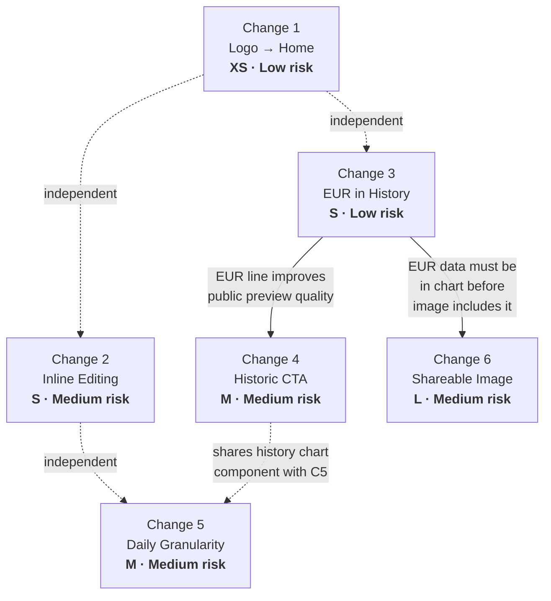
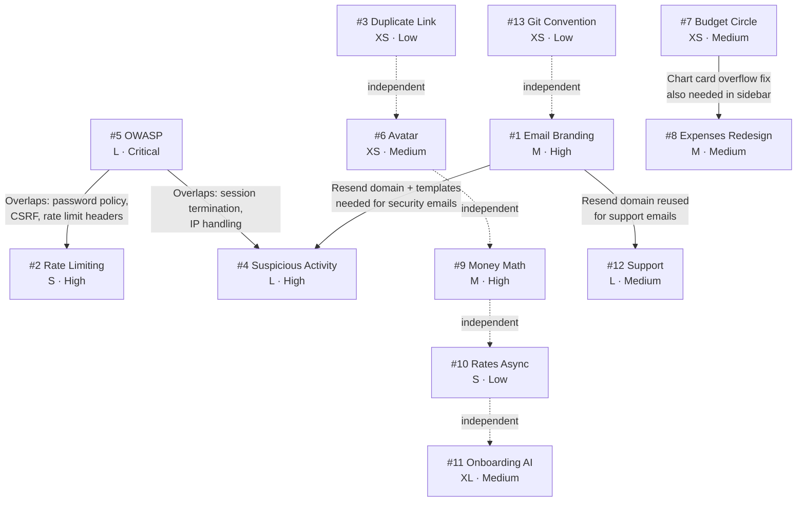

# Phase 2 — Feature Specs & Acceptance Criteria

---

## Change 1 — Logo → Home

**User story:** As any user (public or authenticated), I want to click the Fin logo and be taken to the appropriate home page, so that I always have a reliable escape hatch from wherever I am in the app.

### Scope

**In:**
- Public landing header logo → `/` (localized via next-intl `Link`)
- Dashboard sidebar logo (desktop) → `/dashboard`
- Dashboard mobile header logo → `/dashboard`

**Out:**
- Scroll-to-top behavior (Next.js re-navigating to the same route already resets scroll)
- Logo in the mobile sheet menu of the public header (it is branding-only, not interactive, and already centered for aesthetics)
- Any animation or hover effect beyond what the Link element provides

### UX behavior

1. **Public landing page (desktop):** User clicks the `Isotipo` logo in the top-left of the header → navigates to `/{locale}` (the landing page root). If already on the landing page, the page reloads to the top.
2. **Public landing page (mobile):** Logo in the main header (not inside the sheet) → same as above.
3. **Dashboard (desktop sidebar):** User clicks the `Isotipo` logo in the sidebar header → navigates to `/{locale}/dashboard`.
4. **Dashboard (mobile header):** User clicks the `Isotipo` logo in the dashboard top header → navigates to `/{locale}/dashboard`.

**Edge cases:**
- Already on landing page: Link navigation produces a no-op scroll-reset (acceptable).
- Already on dashboard: Same behavior (acceptable).
- Locale changes: next-intl `Link` auto-prefixes the correct locale — no manual `useLocale()` needed.

### i18n strings needed

None. This change is navigation only.

### Technical approach

**Files to touch:**
- `src/components/public/header.tsx:20` — replace `import Link from "next/link"` usage for the logo with the next-intl `Link` from `@/i18n/navigation.ts`; keep `href="/"` (next-intl's `Link` will localize it automatically).
- `src/components/layout/sidebar.tsx:43-47` — wrap the `<Isotipo>` in a `<Link href="/dashboard">` from `@/i18n/navigation.ts`; add appropriate hover/focus styles to make it feel clickable.
- `src/components/layout/header.tsx:58-60` — wrap the `<Isotipo>` in a `<Link href="/dashboard">` from `@/i18n/navigation.ts`.

**New files:** None.

**New dependencies:** None. `@/i18n/navigation.ts` already exports a localized `Link`.

**Data model changes:** None.

**Server vs client:** All three files are already `"use client"`. No boundary change needed.

**Auth/RLS:** None.

### Acceptance criteria

- [ ] Clicking the logo on the public landing page (desktop) navigates to `/{locale}`.
- [ ] Clicking the logo on the public landing page (mobile, main header) navigates to `/{locale}`.
- [ ] Clicking the logo in the dashboard sidebar navigates to `/{locale}/dashboard`.
- [ ] Clicking the logo in the dashboard mobile header navigates to `/{locale}/dashboard`.
- [ ] All logo links have visible focus rings (accessibility).
- [ ] No extra middleware redirect hop for the public logo (next-intl `Link` generates `/{locale}` directly).

### Test plan

**Unit:** Not applicable (pure navigation, no logic).

**Manual QA:**
1. Open `/{locale}` → click logo → confirm URL stays `/{locale}`.
2. Open `/{locale}/rates` → use dashboard sidebar logo → confirm redirect to `/{locale}/dashboard`.
3. Open `/{locale}/dashboard` → use mobile header logo → confirm redirect to `/{locale}/dashboard`.
4. Check Network tab: public logo link should produce a direct `200` to `/{locale}`, not a `307` redirect.
5. Tab to logo links; confirm focus ring is visible.

**Effort:** XS — two `<Link>` wraps and one import swap. ~30 minutes.

**Risk:** Low. Pure navigation change, no state or data.

---

## Change 2 — Inline Bidirectional Amount Editing

**User story:** As a visitor on the landing page, I want to type an amount in either the "from" or "to" currency field and see the other field update instantly, so that I can calculate conversions in either direction without clicking a swap button.

### Scope

**In:**
- Both `CurrencyCalculator` input fields become editable.
- Typing in one field recomputes the other in real time.
- Swap button is retained; clicking it flips the currency labels (and direction state), recomputing both fields based on the current "from" value.
- EUR, USD, USDT all supported (already are, no change to currency list).

**Out:**
- Copy button behavior (unchanged).
- Rate source label behavior (unchanged).
- Any animation between the two fields.
- Keyboard shortcut for swap.

### UX behavior

1. User opens the landing page. The calculator shows two fields: top = selected currency (e.g., USD), bottom = Bs.
2. User types `50` in the top field → bottom field immediately shows `50 × rate` in Bs.
3. User types `100` in the bottom (Bs) field → top field immediately shows `100 / rate` in the selected currency.
4. User clicks the swap button → the currency labels flip (top becomes Bs, bottom becomes the selected currency); the top field retains its numeric value; the bottom field recomputes.
5. User changes the currency selector (e.g., USD → EUR) → both fields update using the new rate; the "from" field's value is preserved.

**Edge cases:**
- User clears a field (empty string): the other field shows `0` or `""` (do not show `NaN`).
- User types a non-numeric character: ignore (HTML `type="number"` handles this natively, but the "to" field uses `type="text"` — add a numeric guard on `onChange`).
- Rate is `0` (EUR missing from DB): division-by-zero guard → show `0` in result, do not crash.
- Very large numbers: JS `Number` precision is sufficient for bolivar amounts up to 10^15.

### i18n strings needed

None. No new user-facing text. The existing `Landing.currency`, `Landing.usd`, `Landing.usdt`, `Landing.eur`, `Landing.copy`, `Landing.copied` strings are sufficient.

### Technical approach

**Files to touch:**
- `src/components/landing/currency-calculator.tsx` — full state refactor (see below).

**New files:** None.

**New dependencies:** None.

**State refactor:**

Replace the current single `amount: string` state with:
- `fromAmount: string` — value in the "from" field (always the top field)
- `toAmount: string` — value in the "to" field (always the bottom field)
- Remove the `result: number` state (computed inline from `fromAmount` or `toAmount`).
- Retain `currency: CurrencyPair` and `direction: "toBs" | "fromBs"` (direction controls which currency is on top).

**Two-way sync logic (no circular effect):**

```
handleFromChange(val):
  setFromAmount(val)
  const n = parseFloat(val) || 0
  const rate = getRateForCurrency(currency)
  if direction === "toBs":  setToAmount((n * rate).toFixed(2))
  else:                     setToAmount(rate > 0 ? (n / rate).toFixed(2) : "0")

handleToChange(val):
  setToAmount(val)
  const n = parseFloat(val) || 0
  const rate = getRateForCurrency(currency)
  if direction === "toBs":  setFromAmount(rate > 0 ? (n / rate).toFixed(2) : "0")
  else:                     setFromAmount((n * rate).toFixed(2))
```

Each handler sets both states directly — no `useEffect` needed to sync, no circular dependency.

**Swap button behavior:**

```
toggleDirection():
  setDirection(prev => prev === "toBs" ? "fromBs" : "toBs")
  // Recompute toAmount from current fromAmount under the new direction
  // (useEffect watching [direction, fromAmount, currency] handles this)
```

A single `useEffect([currency, direction])` recalculates `toAmount` from `fromAmount` whenever either changes — this handles both currency-selector changes and swap-button clicks without introducing circular effects (it only writes `toAmount`, not `fromAmount`).

**Server vs client:** Already `"use client"`. No change.

**Auth/RLS:** None.

### Acceptance criteria

- [ ] Typing a number in the top (from) field instantly updates the bottom (to) field.
- [ ] Typing a number in the bottom (to) field instantly updates the top (from) field.
- [ ] Clearing either field shows `""` or `"0"` in the other (no NaN).
- [ ] Clicking swap flips the currency labels and recomputes values correctly.
- [ ] Changing the currency selector (USD → EUR → USDT) recomputes both fields without clearing them.
- [ ] When EUR rate is 0 (DB missing), no crash; result shows `0`.
- [ ] Copy button still copies the correct bottom-field value.
- [ ] Rate info line below still shows `1 {currency} = Bs. {rate}`.

### Test plan

**Unit:** Test `handleFromChange` and `handleToChange` with known rates:
- USD rate = 50: input `2` in from → to should be `100.00`
- Input `100` in to → from should be `2.00`
- Input `""` → other shows `0.00`

**Manual QA:**
1. Type in from field → confirm to updates.
2. Type in to field → confirm from updates.
3. Swap → confirm labels flip, values stay consistent.
4. Change currency → confirm re-calculation.
5. Test with EUR (third currency).

**Effort:** S — 2–3 hours. The logic is simple; the risk is the interaction between the swap effect and the direct-set handlers.

**Risk:** Medium. Bidirectional sync in React requires careful sequencing of state updates. Mitigated by the "each handler sets both states directly" pattern — no `useEffect` chain.

---

## Change 3 — EUR Line in Rate History Chart

**User story:** As an authenticated user on the Rates page, I want to see the EUR/VES rate history alongside USD and USDT in the monthly chart, so that I can understand how Euro fluctuations compare with the official USD rate.

### Scope

**In:**
- `RateHistoryPoint` type gains `eur: number | null`.
- `getMonthlyRateHistory()` fetches `EUR_VES` from the DB and populates `eur` per day.
- `RatesHistoryChart` renders a third line for EUR in orange/amber.
- `connectNulls={true}` on all three lines (gaps are bridged).

**Out:**
- EUR in the daily intraday chart (that is Change 5 — it will pick up EUR naturally from the updated type).
- EUR in the public preview chart (Change 4 — it will pick up EUR from the same action).
- Any change to how EUR data is fetched from the external API (already works via `dolarvzla.com`).

### UX behavior

1. User opens `/rates`. The history chart shows three colored lines: blue (USD), green (USDT), amber/orange (EUR).
2. Legend at the bottom shows all three labels.
3. The month selector works identically to before.
4. On days when EUR was not stored (early dates or API outage days), the line bridges across the gap (`connectNulls`).
5. Y-axis domain recalculates to accommodate EUR values (which may differ from USD/USDT by ~10–15%).

### i18n strings needed

| Key | EN | ES |
|---|---|---|
| `Rates.eur_bcv` | `EUR (BCV Official)` | `EUR (BCV Oficial)` |

### Technical approach

**Files to touch:**
- `src/actions/rates.ts`:
  - `RateHistoryPoint` interface: add `eur: number | null`
  - `getMonthlyRateHistory()`: add `"EUR_VES"` to the `.in("pair", [...])` array; initialize `dayMap` entries with `eur: null`; populate `dayData.eur` in the merge loop.
- `src/components/rates/rates-history-chart.tsx`:
  - Update `validRates` domain calculation to include `d.eur`.
  - Add `<Line dataKey="eur" name={t("eur_bcv")} stroke="#f59e0b" strokeWidth={2} dot={{ r: 3 }} activeDot={{ r: 5 }} connectNulls />`.

**New files:** None.

**New dependencies:** None.

**Data model changes:** `RateHistoryPoint` type only (TypeScript interface, no DB change). The `EUR_VES` data is already being written to `exchange_rates`.

**Server vs client:** `getMonthlyRateHistory` is a server action. `RatesHistoryChart` is already client-side. No boundary change.

**Auth/RLS:** `exchange_rates` is readable by authenticated users (existing RLS policy). No change needed.

### Acceptance criteria

- [ ] EUR line appears in the monthly history chart.
- [ ] EUR line color is amber/orange, distinct from blue (USD) and green (USDT).
- [ ] Legend shows all three entries.
- [ ] Y-axis domain accommodates the range of all three rates.
- [ ] On days with no EUR data, the line connects across the gap (no broken segments).
- [ ] Switching months updates all three lines.
- [ ] TypeScript compiles without error (no `eur` field missing from any usage of `RateHistoryPoint`).

### Test plan

**Manual QA:**
1. Navigate to `/rates` — confirm three lines visible.
2. Check a month where EUR data exists (current month) — all three lines have data.
3. Check an older month where EUR may be sparse — EUR line bridges gaps, others unaffected.
4. Run `tsc --noEmit` — no type errors.

**Effort:** S — 1–2 hours. Pure data + rendering addition.

**Risk:** Low. Additive change, no existing behavior modified.

---

## Change 4 — Public Rate History Preview + Signup CTA

**User story:** As an unauthenticated visitor on the landing page, I want to see a preview of the rate history chart and be invited to sign in for full access, so that I understand the value of creating an account before committing.

### Scope

**In:**
- A new read-only "last 30 days" rate history chart section on the landing page (Server Component, no controls).
- A "Sign in to explore full history →" CTA button below or overlaid on the chart, linking to `/{locale}/login`.
- A new server action `getLastNDaysRateHistory(days: number)` that works for anon users.
- A new `PublicRatesHistoryChart` component (simplified, no month selector, no date controls).

**Out:**
- Deep linking to `/rates` (the full in-app view). Unauthenticated users who reach `/rates` are already redirected to login by `requireUser()`.
- Modifying the existing `RatesHistoryChart` component (separate component for public preview).
- Changing the post-signup redirect (the user confirmed they want `/dashboard` after signup — current behavior, no code change).
- Adding a login CTA to the existing `CTASection` (it stays focused on sign-up; the history section has its own CTA).

### UX behavior

1. Visitor scrolls down on the landing page, past the calculator and rate cards.
2. A new section appears: "Rate History" heading, followed by a line chart showing the last 30 days of USD, USDT, and EUR rates (no interactive controls — date selector is hidden).
3. Below or overlapping the chart (bottom overlay recommended — semi-transparent gradient over the bottom 30% of the chart): a card reading "Sign in to explore the full history, filter by date, and track trends over time" with a "Sign In" button.
4. Clicking "Sign In" navigates to `/{locale}/login`.

**Edge cases:**
- No data (new deployment, empty DB): chart area shows a placeholder "No rate data available yet."
- Partial data (fewer than 30 days in DB): chart renders whatever data exists; no error.
- Anon access to `exchange_rates`: RLS already allows anon `SELECT` — no change needed.

### i18n strings needed

| Key | EN | ES |
|---|---|---|
| `Landing.history.title` | `Rate History (Last 30 Days)` | `Historial de Tasas (Últimos 30 días)` |
| `Landing.history.preview_cta` | `Sign in to explore the full history` | `Inicia sesión para explorar el historial completo` |
| `Landing.history.preview_cta_description` | `Filter by date, track trends, and access full rate data.` | `Filtra por fecha, sigue tendencias y accede a todos los datos.` |
| `Landing.history.sign_in` | `Sign In` | `Iniciar sesión` |
| `Landing.history.no_data` | `No rate data available yet.` | `No hay datos de tasas disponibles aún.` |

### Technical approach

**Files to touch:**
- `src/actions/rates.ts` — new exported function `getLastNDaysRateHistory(days: number): Promise<RateHistoryPoint[]>`. Fetches the last `days` calendar days of `USD_VES`, `USDT_VES`, `EUR_VES` from `exchange_rates`, returns one point per calendar day (same aggregation logic as `getMonthlyRateHistory`, but date-range based).
- `src/app/[locale]/(public)/page.tsx` — call `getLastNDaysRateHistory(30)` and pass data to the new section.

**New files:**
- `src/components/public/public-rates-history-chart.tsx` — Client component. Renders a `ResponsiveContainer → LineChart` with three lines (USD, USDT, EUR). No controls. Props: `data: RateHistoryPoint[]`. `connectNulls` on all lines.
- `src/components/public/history-preview-section.tsx` — Server component. Renders: heading, `<PublicRatesHistoryChart>` (as a child), and a bottom-of-chart overlay with the sign-in CTA.

**New dependencies:** None.

**Data model changes:** None. Uses the updated `RateHistoryPoint` type from Change 3.

**Server vs client:**
- `getLastNDaysRateHistory` is a Server Action (already on server).
- `PublicRatesHistoryChart` must be `"use client"` (Recharts requires client).
- `HistoryPreviewSection` is a Server Component that imports the chart as a child.

**Auth/RLS:**
- RLS: `exchange_rates` allows anon `SELECT` — confirmed by migration `20260126190000_fix_exchange_rates_rls.sql`. No change needed.
- `getLastNDaysRateHistory` uses `createClient()` which works with the anon session on the landing page.

**[ASSUMPTION]** The `createClient()` call in `getLastNDaysRateHistory` will use the anon key when called from the landing page (no authenticated session cookie). This is correct per the existing RLS policy.

### Acceptance criteria

- [ ] Landing page shows a "Rate History" section with a line chart of the last 30 days.
- [ ] Chart shows up to three lines: USD (blue), USDT (green), EUR (amber).
- [ ] No interactive controls (month picker, date picker) are visible to unauthenticated users.
- [ ] A "Sign In" CTA is visible on or below the chart.
- [ ] Clicking "Sign In" navigates to `/{locale}/login`.
- [ ] When the DB has no rate data, the section shows a "No data available" message instead of a broken chart.
- [ ] The chart renders correctly at mobile widths (same responsive container as other charts).
- [ ] TypeScript and lint pass.

### Test plan

**Manual QA:**
1. Open landing page while logged out — confirm history section appears.
2. Confirm "Sign In" button navigates to login page.
3. Confirm no console errors related to auth or RLS.
4. Simulate empty DB (or mock): confirm placeholder renders.
5. Check mobile (375px) — chart is usable.

**Effort:** M — 4–6 hours. New action, new components, landing page integration.

**Risk:** Medium. The anon-access assumption must be verified in a real environment. Landing page performance: `getLastNDaysRateHistory` adds a DB query to the landing page Server Component — this should be parallelized with `getExchangeRates()` using `Promise.all`.

---

## Change 5 — Daily (Intraday) Granularity for USDT

**User story:** As an authenticated user on the Rates page, I want to select a specific day and see how the USDT/VES rate evolved throughout that day, so that I can identify the best time to convert.

### Scope

**In:**
- A "Daily" mode toggle in the history chart card (alongside the existing "Monthly" mode).
- In Daily mode: a date picker defaults to today; chart shows all raw `exchange_rates` records for `USDT_VES` (and `USD_VES`, `EUR_VES` as secondary lines) for the selected day, with an HH:mm X-axis.
- New server action `getDailyRateHistory(date: string)` returning `DailyRatePoint[]`.
- URL reflects mode: `?granularity=day&date=YYYY-MM-DD`.
- New Supabase migration: composite index on `(pair, fetched_at)`.

**Out:**
- Intraday data for BTC (not stored per-minute, not relevant).
- Aggregation (min/max/avg per hour) — show raw points only.
- Changing the monthly chart behavior.

### UX behavior

1. User is on `/rates`. The history card has a segmented control or tabs: **Monthly | Daily**.
2. Default: Monthly (current behavior unchanged).
3. User clicks "Daily":
   - Month selector hides; a date picker appears (defaults to today's date).
   - Chart X-axis switches to HH:mm format (e.g., "09:30", "14:00").
   - Chart shows all data points for the selected day — typically up to ~288 for USDT (5-min Binance intervals), fewer for USD/EUR (1-hour BCV intervals).
   - USDT line will be the densest; USD/EUR lines will have sparse points (connected across gaps).
   - If the selected day has no data: "No rate data for this date."
4. User changes the date → chart updates (URL updates → server re-fetches).
5. User clicks "Monthly" → returns to monthly view; date selector hides, month selector reappears.

**Edge cases:**
- Future date selected: no data → "No data" message.
- Date before first `exchange_rates` record in DB: no data → "No data" message.
- Today with only a few hours of data (early morning): chart shows partial day.
- Very many data points (>500): Recharts handles this fine at the chart level; X-axis may tick every N hours to avoid label overlap (use `interval` prop).

### i18n strings needed

| Key | EN | ES |
|---|---|---|
| `Rates.granularity_monthly` | `Monthly` | `Mensual` |
| `Rates.granularity_daily` | `Daily` | `Diario` |
| `Rates.pick_date` | `Pick a date` | `Seleccionar fecha` |
| `Rates.no_data_for_date` | `No rate data for this date.` | `Sin datos de tasa para esta fecha.` |
| `Rates.daily_trend` | `Daily Rate Trend` | `Tendencia Diaria de Tasas` |

### Technical approach

**Files to touch:**
- `src/actions/rates.ts` — new exported type `DailyRatePoint` and function `getDailyRateHistory(date: string)`:
  - Parses `date` as `YYYY-MM-DD`.
  - Queries `exchange_rates` for `pair IN ("USDT_VES", "USD_VES", "EUR_VES")` where `fetched_at` is between `startOfDay` and `endOfDay` (in UTC, being careful with timezone).
  - Returns records sorted by `fetched_at ASC`, each as `{ time: "HH:mm", usdt: number | null, usd: number | null, eur: number | null }`.
- `src/app/[locale]/(dashboard)/rates/page.tsx` — read `granularity` and `date` search params; conditionally call `getDailyRateHistory(date)` or `getMonthlyRateHistory(year, month)`.
- `src/components/rates/rates-history-chart.tsx` — add granularity toggle (tabs/segmented), date picker (reuse `react-day-picker`'s `DayPicker` in popover or simple `<input type="date">`), conditional rendering of monthly vs daily chart, HH:mm X-axis formatter for daily mode.

**New files:** None (all changes in existing files).

**New dependencies:** None. `react-day-picker` is already installed.

**New Supabase migration:**
```sql
-- Improves performance of pair+date range queries used by getDailyRateHistory
CREATE INDEX IF NOT EXISTS idx_exchange_rates_pair_fetched
  ON public.exchange_rates (pair, fetched_at DESC);
```

**Server vs client:**
- `getDailyRateHistory` is a Server Action.
- The page component reads search params server-side and passes data to `RatesHistoryChart`.
- `RatesHistoryChart` (client) handles the toggle, date picker, and URL update via `router.replace`.

**Auth/RLS:** Authenticated-only page (`requireUser()` in layout). No RLS change.

**[ASSUMPTION]** The DB stores `fetched_at` in UTC. The date picker will operate in the user's local timezone. The action will need to convert the local date string to a UTC range (`00:00:00Z` to `23:59:59Z`). A discrepancy of up to 12 hours is possible for users in extreme timezones — acceptable for this use case.

### Acceptance criteria

- [ ] "Monthly | Daily" toggle appears in the history chart card header.
- [ ] Monthly mode is the default and unchanged from current behavior.
- [ ] Switching to Daily mode shows a date picker defaulting to today.
- [ ] Selecting a date with data shows a chart with all records for that day, HH:mm X-axis.
- [ ] USDT line shows the most points (5-min intervals from Binance).
- [ ] USD and EUR lines show fewer points, connected across gaps.
- [ ] Selecting a date with no data shows "No rate data for this date."
- [ ] URL reflects `?granularity=day&date=YYYY-MM-DD` when in Daily mode.
- [ ] Switching back to Monthly mode restores the month selector.
- [ ] The new DB index migration applies cleanly.
- [ ] TypeScript compiles without error on the new `DailyRatePoint` type.

### Test plan

**Unit:**
- `getDailyRateHistory("2026-05-06")` with seed data → returns correctly shaped array with time strings.

**Manual QA:**
1. Switch to Daily → confirm date picker appears, defaults to today.
2. Select a day with USDT data → confirm dense USDT line; check HH:mm axis labels.
3. Select a day before the app launched → confirm "No data" state.
4. Navigate browser back → confirm URL state is preserved.
5. Run `supabase db push` (local) with the new migration → confirm no error.

**Effort:** M — 1–2 days. New action, migration, chart mode, date picker integration.

**Risk:** Medium. Timezone handling (local vs UTC) in the date query. Recharts X-axis label density with 200+ points (use `interval="preserveStartEnd"` or calculate a tick interval).

---

## Change 6 — Shareable Rates Image

**User story:** As an authenticated user on the Rates page, I want to generate and share a branded image of the day's rates, so that I can quickly inform my contacts of current exchange rates without manually typing them.

### Scope

**In:**
- A "Share Rates" button on the `/rates` page (authenticated only).
- A dialog (modal) with two steps:
  1. Select which rate pairs to include (checkboxes: USDT/VES, USD/VES, EUR/VES — default all checked).
  2. Select target platform (WhatsApp/General = 1:1 square, Twitter/X = 16:9, Instagram Story = 9:16 portrait).
- A hidden branded image template (React `div`) rendered off-screen.
- `html-to-image` (lazy-loaded) captures the template as a PNG.
- `navigator.share({ files: [pngFile] })` opens the native share sheet; if unavailable, falls back to `<a download>`.

**Out:**
- Share button on the public landing page (authenticated `/rates` only, per user decision).
- BTC/USD or BTC/USDT in the image (only USDT, USD, EUR).
- Server-side image generation.
- Animated/video sharing.

### UX behavior

1. User is on `/rates`. A "Share Rates" button appears in the page header area (near `RatesTitle`).
2. Clicking opens a `Dialog`:
   - **Step 1 — Select rates:** Three checkboxes: USDT/VES ✓, USD/VES ✓, EUR/VES ✓ (all checked by default). User can uncheck any.
   - **Step 2 — Select platform:** Three option cards with icons:
     - "WhatsApp / General" (square 1:1)
     - "Twitter / X" (landscape 16:9)
     - "Instagram Story" (portrait 9:16)
   - A "Generate & Share" primary button.
3. User clicks "Generate & Share":
   - Button shows loading state ("Generating…").
   - The hidden image template is rendered with the selected pairs and current rates.
   - `html-to-image.toPng()` captures it.
   - If `navigator.share` is available and supports files: opens native share sheet.
   - If not (desktop browser): triggers a file download (`rates-YYYY-MM-DD.png`).
4. Success: dialog closes (or stays open for another share).

**Edge cases:**
- User unchecks all pairs: "Generate & Share" is disabled with tooltip "Select at least one rate."
- `html-to-image` throws (e.g., CORS on SVG assets): show a Sonner toast error "Could not generate image. Please try again."
- Rate data is stale: image shows whatever is in the current `rates` prop — always reflects what the user sees on screen.
- Mobile Safari: `navigator.share` is available and supports files — happy path. If file sharing not supported, fall back to download.

### i18n strings needed

| Key | EN | ES |
|---|---|---|
| `Rates.share_rates` | `Share Rates` | `Compartir Tasas` |
| `Rates.share_dialog_title` | `Share Today's Rates` | `Compartir Tasas de Hoy` |
| `Rates.share_step_rates` | `Select rates to include` | `Selecciona las tasas a incluir` |
| `Rates.share_step_platform` | `Select sharing format` | `Selecciona el formato` |
| `Rates.share_platform_general` | `WhatsApp / General` | `WhatsApp / General` |
| `Rates.share_platform_twitter` | `Twitter / X` | `Twitter / X` |
| `Rates.share_platform_story` | `Instagram Story` | `Instagram Story` |
| `Rates.share_generate` | `Generate & Share` | `Generar y Compartir` |
| `Rates.share_generating` | `Generating…` | `Generando…` |
| `Rates.share_error` | `Could not generate image. Please try again.` | `No se pudo generar la imagen. Inténtalo de nuevo.` |
| `Rates.share_select_at_least_one` | `Select at least one rate` | `Selecciona al menos una tasa` |

### Technical approach

**Files to touch:**
- `src/app/[locale]/(dashboard)/rates/page.tsx` — pass `rates` data down to a new `ShareRatesButton` component (or use a client wrapper).
- `src/components/rates/rates-title.tsx` — add `ShareRatesButton` to the title area.

**New files:**
- `src/components/rates/share-rates-button.tsx` — `"use client"` component. Contains the Dialog, checkboxes, platform selector, and generation logic. Lazy-imports `html-to-image`.
- `src/components/rates/share-rates-image-template.tsx` — `"use client"` component. A styled `div` (fixed dimensions, off-screen via `position: absolute; left: -9999px`) used as the capture target. Renders: Fin logo (from `/public/isologo.svg`), rate rows for selected pairs, date, `fin.app` (or the actual URL).

**New dependencies:**
- `html-to-image` — ~30KB gzip. Justification: purpose-built for React component → PNG conversion; `dom-to-image-more` is unmaintained; `satori` requires server-side rendering and a separate font-loading pipeline. Lazy-loaded (`await import('html-to-image')`) so it does not increase the initial page bundle.

**Data model changes:** None. Image uses the `RateData[]` already passed to the rates page.

**Server vs client:**
- `ShareRatesButton` and `ShareRatesImageTemplate` are `"use client"`.
- The template div must be mounted in the DOM when capture runs — use a React `ref` on a hidden wrapper rendered alongside the button.

**Auth/RLS:** `/rates` is already auth-gated via `requireUser()` in layout. No additional RLS consideration.

**Image template spec:**
- Fin logo (top left): `/public/isologo.svg` via `` tag (not Next.js `Image` — `html-to-image` may not handle the Next.js image proxy correctly; use raw `` with an absolute URL or inline SVG).
- Date (top right): `"May 6, 2026"` formatted via `date-fns/format`.
- Rate rows: each selected pair shows the pair name, rate value, source, and trend arrow.
- Footer: `"fin.app"` and tagline.
- Dimensions set on the template div: 800×800 (1:1), 1200×675 (16:9), 1080×1920 (9:16) — set via `width`/`height` style attributes before capture.

**[ASSUMPTION]** The `isologo.svg` in `/public/` can be referenced as a relative URL by `html-to-image` during capture. If CORS issues arise with SVG, inline the SVG or convert to a base64 data URL at build time.

### Acceptance criteria

- [ ] "Share Rates" button appears on the `/rates` page.
- [ ] Clicking the button opens a dialog.
- [ ] Dialog shows three rate checkboxes (USDT/VES, USD/VES, EUR/VES) — all checked by default.
- [ ] Dialog shows three platform options (WhatsApp/General, Twitter/X, Instagram Story).
- [ ] "Generate & Share" is disabled when no rates are checked.
- [ ] Clicking "Generate & Share" with valid selections:
  - Shows "Generating…" state.
  - On mobile: opens native share sheet with the PNG file.
  - On desktop (no `navigator.share`): downloads a PNG file named `rates-YYYY-MM-DD.png`.
- [ ] Generated image contains the Fin logo, selected rate pairs with current values, today's date, and `fin.app` URL.
- [ ] Image dimensions match the selected platform (1:1, 16:9, 9:16).
- [ ] Error toast appears if image generation fails.
- [ ] `html-to-image` is not included in the initial page bundle (lazy-loaded on button click).
- [ ] TypeScript compiles without error.

### Test plan

**Unit:**
- Test that "Generate & Share" is disabled when `selectedPairs` is empty.

**Manual QA:**
1. Open `/rates` → click "Share Rates" → confirm dialog opens.
2. Uncheck all pairs → confirm button disabled.
3. Select "WhatsApp / General" → click "Generate & Share" → confirm download on desktop.
4. On mobile (real device): confirm native share sheet opens.
5. Inspect downloaded PNG: verify Fin logo, rate values, date, URL.
6. Test each platform option → confirm image dimensions in EXIF or via image viewer.
7. Open DevTools Network → confirm `html-to-image` chunk only loads after clicking "Generate & Share."

**Effort:** L — 2–3 days. New Dialog, image template, generation pipeline, share/download logic.

**Risk:** Medium.
- `html-to-image` + SVG logo CORS: mitigate by inlining the SVG or using a base64 data URL.
- `navigator.share` file support varies by browser/OS: mitigated by the download fallback.
- Image template styling: Tailwind CSS-in-JS classes may not render correctly in the captured `div` because `html-to-image` uses computed styles — use inline styles or ensure the template is in the rendered DOM tree with full CSS applied.

---

## Dependency Graph



**Hard block:** Change 3 must be done before Change 6 (the shareable image should show a correct EUR rate).

**Soft dependency:** Change 3 should ideally be done before Change 4 (the public preview chart will look more complete with the EUR line).

**All others are independent.**

---

## Recommended Execution Order

| Order | Change | Rationale |
|---|---|---|
| 1 | **Change 1** — Logo | Smallest change, zero risk, immediate visible improvement, unblocks nothing. |
| 2 | **Change 3** — EUR in history | Small additive change that unblocks both Change 4 and Change 6. Ship it early. |
| 3 | **Change 2** — Inline editing | Independent, medium complexity, high UX value on the landing page. |
| 4 | **Change 4** — Historic CTA | Depends on Change 3 for EUR completeness. Adds landing page value. |
| 5 | **Change 5** — Daily granularity | Independent but logically grouped with the history/rates view. Includes DB migration. |
| 6 | **Change 6** — Shareable image | Largest, depends on Change 3. Saved for last so EUR rates are guaranteed correct. |

---

## Effort Summary

| Change | Effort | Risk |
|---|---|---|
| 1 — Logo → Home | XS (~30 min) | Low |
| 2 — Inline Editing | S (~3 hrs) | Medium |
| 3 — EUR in History | S (~2 hrs) | Low |
| 4 — Historic CTA + Preview | M (~6 hrs) | Medium |
| 5 — Daily Granularity | M (~12 hrs) | Medium |
| 6 — Shareable Image | L (~20 hrs) | Medium |
| **Total** | **~43 hrs** | |

---

---

# Phase 2 — Fix Specs & Acceptance Criteria (Batch 2: 13-Item Fix Batch)

> Decisions locked from clarifying-question answers on 2026-05-06.

---

### Item 1 — Email Branding

**Type:** Feature
**Severity:** High
**Size:** M

**User story / outcome:** When Fin sends any transactional email (signup confirmation, password reset, email change, security alerts), it arrives from a recognizable `fin@zergcore.dev` address inside a branded HTML template that matches the app's visual identity — not a generic Supabase or sandbox email.

**Scope (in):**
- Set up `zergcore.dev` subdomain (e.g., `mail.zergcore.dev`) in Resend with DKIM/SPF/DMARC records.
- Sender address: `Fin <fin@zergcore.dev>`.
- Three branded HTML email templates: signup confirmation, password reset, email change.
- Wire Supabase auth emails to use these templates via `supabase/config.toml` custom template paths.
- Add `RESEND_API_KEY` and `DEVELOPER_EMAIL` to `.env.example`.
- Update existing `alert-email.ts` sender from `onboarding@resend.dev` to `fin@zergcore.dev`.

**Scope (out):**
- Purchasing a dedicated domain (`fin.app` or similar).
- Email unsubscribe/preference management.
- Rich media (images, hero photos) in templates beyond the logo.
- Plain-text preview optimization (default Supabase plain-text is acceptable for v1).

**UX behavior:**
- All auth emails arrive from `Fin <fin@zergcore.dev>`.
- HTML template: Fin isotipo logo centered at top, brand color accent (`--primary`), clean sans-serif body, clear CTA button. Light-mode design (email clients don't reliably support dark mode).
- Footer: "© Fin · zergcore.dev" + unsubscribe placeholder (informational).
- Password reset email: subject "Reset your Fin password", CTA "Reset Password", 1-hour expiry note.
- Signup confirmation: subject "Confirm your Fin account", CTA "Confirm Email".
- Email change: subject "Confirm your new email", two confirmation steps noted (both old and new email must confirm, per `double_confirm_changes = true`).

**Technical approach:**
- Files to touch: `supabase/config.toml`, `src/lib/alert-email.ts`, `.env.example`.
- New files: `supabase/templates/confirmation.html`, `supabase/templates/recovery.html`, `supabase/templates/email_change.html`.
- Supabase template variables: `{{ .ConfirmationURL }}`, `{{ .SiteURL }}`, `{{ .Email }}`.
- Wire via `config.toml`:
  ```toml
  [auth.email.smtp]
  enabled = true
  host = "smtp.resend.com"
  port = 465
  user = "resend"
  pass = "env(RESEND_API_KEY)"
  admin_email = "fin@zergcore.dev"
  sender_name = "Fin"

  [auth.email.template.confirmation]
  subject = "Confirm your Fin account"
  content_path = "./supabase/templates/confirmation.html"

  [auth.email.template.recovery]
  subject = "Reset your Fin password"
  content_path = "./supabase/templates/recovery.html"

  [auth.email.template.email_change]
  subject = "Confirm your new email"
  content_path = "./supabase/templates/email_change.html"
  ```
- New dependency: none (Resend already installed; SMTP is the wiring mechanism here).
- Server vs client: template rendering is server/Supabase-side. No component changes.
- RLS implications: none.
- Security: DKIM/SPF/DMARC on `zergcore.dev` prevents email spoofing.

**Acceptance criteria:**
- [ ] Resend dashboard shows `zergcore.dev` as a verified sending domain with DKIM and SPF passing.
- [ ] Registering a new account triggers a confirmation email from `fin@zergcore.dev` with the Fin HTML template.
- [ ] Requesting a password reset sends a branded email from `fin@zergcore.dev`.
- [ ] Email change triggers branded emails to both old and new address.
- [ ] Developer alert email (`alert-email.ts`) also sends from `fin@zergcore.dev`.
- [ ] `.env.example` includes `RESEND_API_KEY`, `DEVELOPER_EMAIL`, `CRON_SECRET`.
- [ ] Local dev uses Supabase Inbucket (no real emails sent) — no code change required.

**Rollback plan:** If Resend SMTP fails, comment out `[auth.email.smtp]` in `config.toml` to revert to Supabase's built-in email. Sender reverts to Supabase default. Alert email falls back gracefully (already guards with `if (!apiKey) return`).

---

### Item 2 — Password-Reset Rate Limiting

**Type:** Security
**Severity:** High
**Size:** S

**User story / outcome:** A user who requests a password reset gets a clear cooldown — they cannot flood their own inbox or abuse the endpoint, and the app communicates the wait time gracefully.

**Scope (in):**
- Raise Supabase `max_frequency` from `"1s"` to `"60s"` (server-enforced per email address).
- Server Action `resetPassword` gains an in-memory / header-level guard: if the same email submitted a reset in the last 60 seconds (tracked via a short-lived Supabase DB record or a response check), return a cooldown error.
- Client-side: after a successful submission, disable the submit button for 60 seconds with a countdown ("Resend in 47s").
- Static user message on submission: "If this email is registered, you'll receive a reset link shortly. Please wait before requesting again."

**Scope (out):**
- Per-IP rate limiting at middleware level (covered by #5 OWASP).
- Persistent attempt logging (that's #4 suspicious activity).
- Email-level cooldown beyond 60 seconds (Supabase's `email_sent = 2/hour` is the coarse outer limit).

**UX behavior:**
- Happy path: user enters email → clicks submit → button shows "Sending…" → on success, button disables with 60s countdown → message "If this email is registered, you'll receive a reset link shortly."
- During cooldown: button shows "Resend in 47s" (counting down), is disabled.
- Error from Supabase (rate limit hit): show same static message — never reveal whether an email exists.
- After 60s: button re-enables normally.

**i18n strings (new):**

| Key | EN | ES |
|---|---|---|
| `Auth.resetSent` | `If this email is registered, you'll receive a reset link shortly.` | `Si este correo está registrado, recibirás un enlace en breve.` |
| `Auth.resendIn` | `Resend in {seconds}s` | `Reenviar en {seconds}s` |

**Technical approach:**
- Files to touch: `supabase/config.toml` (`max_frequency = "60s"`), `src/app/[locale]/(auth)/forgot-password/page.tsx` (switch from Auth UI to a custom form using `resetPassword` Server Action).
- The forgot-password page currently uses `<Auth view="forgotten_password">` — replacing it with a custom `<form>` + `useFormState` (React 19 `useActionState`) gives full control over the cooldown UI.
- Client countdown: `useState(cooldownSeconds)` + `useEffect` interval decrementing each second.
- Server-side: Supabase's own `max_frequency = "60s"` is the authoritative guard. The client countdown is UX only — security lives on the server.
- No new dependency. No DB migration.

**Acceptance criteria:**
- [ ] `supabase/config.toml` shows `max_frequency = "60s"`.
- [ ] Submitting the form disables the button for 60 seconds with a live countdown.
- [ ] The success message is always shown (does not reveal whether the email exists).
- [ ] A second submission within 60s returns an error from Supabase and shows the cooldown UI — not a new email.
- [ ] TypeScript and lint pass.

**Rollback plan:** Revert `max_frequency` to `"1s"` in `config.toml`. Client countdown change has zero risk.

---

### Item 3 — Duplicate "Forgot Password" Link

**Type:** Bug Fix
**Severity:** Low
**Size:** XS

**User story / outcome:** The login page shows exactly one "Forgot your password?" link, not two.

**Scope (in):**
- Add `showLinks={false}` to the `<Auth>` component in `src/app/[locale]/(auth)/login/page.tsx`.

**Scope (out):**
- Any restyling of the existing custom link.
- Changes to the forgot-password page itself.

**UX behavior:**
- One "Forgot your password?" link, styled with the existing custom `<Link>` component (already present at lines 77–84 of the login page).

**Technical approach:**
- One file, one prop change: `<Auth ... showLinks={false} />`.
- No new dependencies, no i18n changes, no DB changes.

**Acceptance criteria:**
- [ ] Exactly one "Forgot your password?" link is visible on the login page.
- [ ] The remaining link navigates to `/{locale}/forgot-password`.
- [ ] The `<Auth>` component's email/password fields still render correctly.

---

### Item 4 — Suspicious-Activity Emails

**Type:** Feature + Security
**Severity:** High
**Size:** L

**User story / outcome:** When something unusual happens on a user's account — a sign-in from a new country, repeated failed login attempts, or multiple password-change requests in a short window — Fin sends an email alert so the user can take action.

**Scope (in):**
- Replace `@supabase/auth-ui-react`'s `<Auth>` on login page with a custom sign-in form (Server Action `signIn`).
- `signIn` Server Action reads `x-vercel-ip-country` header for country detection.
- Three suspicious triggers for v1:
  1. Sign-in from a country different from the user's last-known country.
  2. ≥ 3 failed sign-in attempts from the same IP within 15 minutes.
  3. ≥ 2 password-change requests within 24 hours.
- Each trigger: write a `login_events` record + send a Resend email to the user.
- Email includes a "This wasn't me — Secure my account" link → a Server Action that calls `supabase.auth.admin.signOut(userId, { scope: 'global' })` (terminates all sessions).
- Persist events in a new `login_events` table (RLS: user can read own events).

**Scope (out):**
- Admin dashboard for viewing events (user-facing only).
- Impossible-travel detection (requires device fingerprinting — future).
- MFA enforcement on suspicious sign-in (future).
- Blocking sign-ins (v1 is detect + alert, not block).

**UX behavior:**
- Happy path: user logs in normally — no change to experience.
- New country detected: sign-in succeeds + security email sent in background.
- Failed attempts (≥ 3 in 15 min): sign-in rejected with generic "Invalid credentials" message (no revealing of attempt count) + security email to the account holder's email.
- Password change spam: email sent silently after 2nd change within 24h.
- Security email content: "We noticed a sign-in to your Fin account from [Country]. If this was you, no action needed. If not, click below to secure your account." → "Secure My Account" button.
- "Secure My Account" link: one-time token in URL → server validates → signs out all sessions → redirects to login with message "All sessions terminated. Please sign in again."

**i18n strings (new):**

| Key | EN | ES |
|---|---|---|
| `Auth.signingIn` | `Signing in…` | `Iniciando sesión…` |
| `Auth.signIn` | `Sign in` | `Iniciar sesión` |
| `Auth.invalidCredentials` | `Invalid email or password.` | `Correo o contraseña incorrectos.` |
| `Security.emailSubject` | `New sign-in to your Fin account` | `Nuevo inicio de sesión en tu cuenta Fin` |
| `Security.sessionTerminated` | `All sessions have been terminated. Please sign in again.` | `Todas las sesiones han sido cerradas. Por favor inicia sesión de nuevo.` |

**Technical approach:**
- New files:
  - `src/actions/auth-events.ts` — `signIn(formData)`, `terminateAllSessions(token)` Server Actions.
  - `src/lib/suspicious-activity.ts` — `detectSuspiciousActivity(userId, event)` helper; checks thresholds against `login_events`; sends Resend email.
  - `src/components/auth/sign-in-form.tsx` — custom `"use client"` form using `useActionState` + the `signIn` Server Action.
  - `supabase/templates/security-alert.html` — branded security email template.
- Files to touch:
  - `src/app/[locale]/(auth)/login/page.tsx` — replace `<Auth>` with `<SignInForm>`.
  - `src/lib/alert-email.ts` — add `sendSecurityAlert(email, country, terminateUrl)`.
- New Supabase migration: `login_events` table.

```sql
CREATE TABLE public.login_events (
  id UUID DEFAULT gen_random_uuid() PRIMARY KEY,
  user_id UUID REFERENCES auth.users(id) ON DELETE CASCADE NOT NULL,
  event_type TEXT NOT NULL, -- 'sign_in', 'failed_attempt', 'password_change'
  ip_address TEXT,
  country_code TEXT,
  user_agent TEXT,
  is_suspicious BOOLEAN DEFAULT FALSE,
  created_at TIMESTAMPTZ DEFAULT NOW()
);

ALTER TABLE public.login_events ENABLE ROW LEVEL SECURITY;
CREATE POLICY "Users can view own login events"
  ON public.login_events FOR SELECT USING (auth.uid() = user_id);
-- INSERT via service role only (from Server Actions using service client)
```

- `signIn` uses `supabase.auth.signInWithPassword` inside a Server Action so the server has full access to request headers (`x-vercel-ip-country`, `user-agent`, IP from `x-forwarded-for`).
- Country comparison: load user's last sign-in country from `login_events` (most recent `sign_in` record). If different → flag.
- Failed attempts: count `login_events` where `event_type = 'failed_attempt'` and `ip_address = currentIp` and `created_at > NOW() - INTERVAL '15 minutes'` — if ≥ 3, send alert.
- Terminate-all-sessions token: a short-lived Supabase JWT or a one-time token stored in a `session_terminate_tokens` table (simpler: use a signed URL with a HMAC of `userId + timestamp`, validated server-side).
- Security implications: Server Action validates CSRF via Next.js built-in origin check. IP from `x-forwarded-for` (trust first hop only). Never log passwords.
- RLS: `login_events` INSERT via `createServiceClient()`.

**Acceptance criteria:**
- [ ] Login page shows a custom email/password form (not `@supabase/auth-ui-react` Auth component).
- [ ] Signing in from a different country (simulated via `x-vercel-ip-country` header) triggers a security email to the user.
- [ ] 3+ failed attempts from the same IP within 15 minutes trigger a security email.
- [ ] 2+ password-change requests within 24 hours trigger a security email.
- [ ] Security email arrives from `fin@zergcore.dev` with Fin branding.
- [ ] "Secure My Account" link in the email terminates all sessions and redirects to login.
- [ ] Sign-in events are stored in `login_events` table.
- [ ] A failed sign-in attempt shows "Invalid email or password." (no enumeration).
- [ ] TypeScript, lint, and `npx tsc --noEmit` pass.

**Test plan:**
- Unit: `detectSuspiciousActivity` with mocked DB responses — test each threshold.
- Manual QA: simulate new-country header; attempt 3 failed logins; verify email arrives in Resend dashboard.

**Rollback plan:** If the custom sign-in form causes issues, restore `<Auth>` component on the login page (one-line revert). The `login_events` table is additive — no rollback needed for the migration.

---

### Item 5 — OWASP Compliance

**Type:** Security
**Severity:** Critical
**Size:** L

**User story / outcome:** Fin meets OWASP ASVS Level 1 (baseline) across all controls, with Level 2 applied to authentication and session management — the most critical attack surface for a personal finance app.

**Scope (in):**
- Security headers in `next.config.ts`: CSP (permissive allowlist), HSTS, X-Frame-Options, X-Content-Type-Options, Referrer-Policy, Permissions-Policy.
- Password policy: `minimum_password_length = 8`, `password_requirements = "letters_digits"`, `secure_password_change = true`.
- RLS gaps: add INSERT to `notifications`, DELETE to `notification_preferences`, `financial_insights`, `storage.objects` (avatars).
- `.env.example`: add `RESEND_API_KEY`, `CRON_SECRET`, `DEVELOPER_EMAIL`, `SUPPORT_EMAIL`.
- `next/image` `remotePatterns`: add Supabase storage hostname.
- NEXT_LOCALE cookie: add `secure`, `sameSite: "lax"` flags in middleware.
- Auth redirect allowlist: document production URL must be added to Supabase Cloud dashboard.
- CAPTCHA: not enabled in v1 (Turnstile used for support form in #12 instead).

**Scope (out):**
- MFA (Supabase Pro feature).
- Web Application Firewall.
- Penetration test.
- Logging infrastructure (structured log service).

**Technical approach:**
- `next.config.ts` — add `headers()` returning security header array:

```typescript
const securityHeaders = [
  { key: "X-Frame-Options", value: "SAMEORIGIN" },
  { key: "X-Content-Type-Options", value: "nosniff" },
  { key: "Referrer-Policy", value: "strict-origin-when-cross-origin" },
  { key: "Permissions-Policy", value: "camera=(), microphone=(), geolocation=()" },
  {
    key: "Strict-Transport-Security",
    value: "max-age=63072000; includeSubDomains; preload",
  },
  {
    key: "Content-Security-Policy",
    value: [
      "default-src 'self'",
      "script-src 'self' 'unsafe-inline' 'unsafe-eval'", // unsafe-eval needed by Recharts/Next.js dev; tighten in future
      "style-src 'self' 'unsafe-inline'",
      "img-src 'self' data: blob: https://*.supabase.co https://*.supabase.in",
      "connect-src 'self' https://*.supabase.co https://*.supabase.in wss://*.supabase.co https://api.resend.com",
      "font-src 'self'",
      "frame-ancestors 'none'",
    ].join("; "),
  },
];
```

- `supabase/config.toml`: `minimum_password_length = 8`, `password_requirements = "letters_digits"`, `secure_password_change = true`.
- New migration for missing RLS policies (additive):

```sql
-- notifications INSERT (service role inserts; this policy allows system inserts)
-- No user INSERT policy needed — system-only writes use service client

-- DELETE policies
CREATE POLICY "Users can delete own notification preferences"
  ON public.notification_preferences FOR DELETE USING (auth.uid() = user_id);

CREATE POLICY "Users can delete own financial insights"
  ON public.financial_insights FOR DELETE USING (auth.uid() = user_id);

-- Storage avatar DELETE
CREATE POLICY "Users can delete own avatars"
  ON storage.objects FOR DELETE USING (auth.uid() = owner AND bucket_id = 'avatars');
```

- Middleware cookie fix: add `secure: true, sameSite: "lax"` to `NEXT_LOCALE` cookie.
- `next.config.ts` `images.remotePatterns`: add Supabase project storage pattern.

**Acceptance criteria:**
- [ ] `curl -I https://[deployed-url]` returns all security headers (X-Frame-Options, X-Content-Type-Options, HSTS, CSP, Referrer-Policy, Permissions-Policy).
- [ ] Attempting password change without re-authentication is rejected (Supabase `secure_password_change = true`).
- [ ] Password < 8 characters is rejected at registration.
- [ ] Password with only letters is rejected (requires letters + digits).
- [ ] `RESEND_API_KEY`, `CRON_SECRET`, `DEVELOPER_EMAIL`, `SUPPORT_EMAIL` are documented in `.env.example`.
- [ ] `next/image` renders avatar images without domain errors.
- [ ] `NEXT_LOCALE` cookie has `Secure` and `SameSite=Lax` flags (inspect in DevTools).
- [ ] DELETE on `notification_preferences`, `financial_insights`, and `avatars` storage objects works for the owning user.
- [ ] TypeScript and lint pass. Build succeeds.

**Rollback plan:** Security headers are additive and can be removed from `next.config.ts` without breaking functionality. Config.toml password policy change affects only new registrations. RLS policies are additive. Cookie flag change is safe.

---

### Item 6 — Avatar Not Rendering in Header

**Type:** Bug Fix
**Severity:** Medium
**Size:** XS

**User story / outcome:** When a user has uploaded a profile photo, their avatar appears in the top-right corner of every dashboard page, not just on the profile page.

**Scope (in):**
- Add `<AvatarImage src={user.user_metadata?.avatar_url ?? ""} />` to the `Avatar` in `src/components/layout/header.tsx`.
- Import `AvatarImage` from `@/components/ui/avatar`.

**Scope (out):**
- Fallback generation logic changes (initials fallback already works correctly).
- next/image optimization for avatars (the `<AvatarImage>` renders a plain `` via Radix — fine for v1).

**UX behavior:**
- If user has `avatar_url`: circle shows the photo; fallback (`{initials}`) renders only if the image fails to load (Radix `Avatar` handles this automatically).
- If user has no `avatar_url`: circle shows email initials as before.

**Technical approach:**
- One file: `src/components/layout/header.tsx`.
- Change: add `import { Avatar, AvatarFallback, AvatarImage } from "@/components/ui/avatar"` (add `AvatarImage`) and insert `<AvatarImage src={user.user_metadata?.avatar_url ?? ""} alt="" />` before `<AvatarFallback>`.

**Acceptance criteria:**
- [ ] A user with an uploaded avatar sees their photo in the header after logging in.
- [ ] A user without an avatar still sees email initials.
- [ ] No console errors or broken image requests.

---

### Item 7 — Budget Circle Clipped

**Type:** Bug Fix
**Severity:** Medium
**Size:** XS

**User story / outcome:** The donut chart in the Budget Summary KPI card displays without its edges being clipped by the card container.

**Scope (in):**
- Remove `overflow-hidden` from the budget summary card in `src/components/expenses/kpi-header.tsx`.
- If the gradient decorative accent requires `overflow-hidden`, reimplement it without the clip (e.g., scoped to a separate `div` inside the card, not the card itself).

**Scope (out):**
- Resizing or redesigning the donut chart.
- Changes to `chart-card.tsx` in `ExpensesSidebar` (deferred to #8 expenses redesign).

**UX behavior:**
- The donut chart renders fully rounded with no square clip on any edge.
- The decorative color accent at the top of the card continues to display.

**Technical approach:**
- `src/components/expenses/kpi-header.tsx`: on the first `Card`, remove `overflow-hidden` from `className`. Move the gradient accent `div` into a child `div` positioned absolutely inside the card, with `overflow-hidden` applied only to that inner `div`.

**Acceptance criteria:**
- [ ] The donut chart in the Budget Summary card is fully visible, no square clip.
- [ ] The gradient top accent still displays.
- [ ] No layout shifts or overflow on the card at any viewport width.

---

### Item 8 — Expenses View Redesign

**Type:** UX / Feature
**Severity:** Medium
**Size:** M

**User story / outcome:** The expenses page communicates financial status at a glance — it has a clear visual hierarchy, surfaces the analytical sidebar that was already built, and feels intentional rather than templated.

**Scope (in):**
- Surface `ExpensesSidebar` in the expenses page layout (it's built; it just isn't rendered).
- Redesign the page into a two-column layout on desktop (main table left, sidebar right) and single-column on mobile (sidebar collapses below table or into a collapsible card).
- Improve the empty state: icon + action-oriented copy + "Add your first expense →" CTA.
- Improve the table footer: reduce visual noise, give USD total prominence.
- Improve the KPI card section: one card gets visual emphasis (budget summary); others are secondary.
- Fix the budget circle clipping (from #7, already specced separately).

**Scope (out):**
- New chart types beyond what's already in `ExpensesSidebar`.
- Removing the `DataTable` (it stays; we improve its surroundings).
- Animated transitions.

**Design direction (minimalist + informative):**
Fin's style: high signal-to-noise. The redesign takes cues from tools like Lunch Money and Actual Budget — clean typography, one clearly dominant number per section, restrained use of color (only for state changes: over-budget = red, on-track = primary).

**ASCII wireframe — Desktop (≥ lg breakpoint):**

```
┌─────────────────────────────────────────────────────────────────────┐
│  Expenses                              [Add Expense] [Scan Receipt] │
│  ◀ April 2026 ▶                                         [Export ↓]  │
├──────────────────────────────────────────┬──────────────────────────┤
│                                          │  ┌──────────────────┐   │
│  ┌────────┐  ┌──────────┐  ┌──────────┐ │  │  Budget Overview  │   │
│  │ Budget │  │  Daily   │  │ EOM Proj │ │  │   [donut chart]   │   │
│  │Summary │  │  Avg     │  │          │ │  │   68% used        │   │
│  │(emph.) │  │(secondary│  │(secondary│ │  │  $340 / $500      │   │
│  └────────┘  └──────────┘  └──────────┘ │  ├──────────────────┤   │
│  [Unbudgeted alert if any]               │  │  Daily Spending  │   │
│                                          │  │  $12.40 / $16.67 │   │
│  Search…           [ALL][VES][USD][USDT] │  ├──────────────────┤   │
│  [All cats][Food][Transport][Shopping]   │  │  EOM Projection  │   │
│  ┌──────────────────────────────────┐   │  │  $408 projected  │   │
│  │ Date    Desc    Category  Amount │   │  └──────────────────┘   │
│  │ May 6   Lunch   Food      $8.50  │   │                         │
│  │ May 5   Bus     Transport $1.20  │   │                         │
│  │ ...                              │   │                         │
│  └──────────────────────────────────┘   │                         │
│  [← Prev]                    [Next →]   │                         │
└──────────────────────────────────────────┴─────────────────────────┘
```

**ASCII wireframe — Empty state:**

```
┌────────────────────────────────────────┐
│  Expenses                  [Add Expense]│
│  ◀ May 2026 ▶                          │
│                                        │
│         💸                             │
│   No expenses yet this month           │
│   Track your first expense to start    │
│   building your financial picture.     │
│                                        │
│        [+ Add your first expense]      │
└────────────────────────────────────────┘
```

**Technical approach:**
- `src/app/[locale]/(dashboard)/expenses/page.tsx`: add `ExpensesSidebar` to the layout. Use a two-column CSS grid: `grid-cols-1 lg:grid-cols-[1fr_300px]`.
- `src/components/expenses/kpi-header.tsx`: make the first card (Budget Summary) visually dominant — slightly larger or with a stronger accent; demote the other three to a supporting row.
- `src/components/expenses/data-table.tsx`: improve empty state row — replace `h-24 text-center` plain text with an icon + message + CTA button.
- `src/components/expenses/expense-chart/chart-card.tsx`: ensure `ExpensesSidebar` renders correctly once wired in (already built; minimal changes expected).
- No new dependencies.

**i18n strings (new):**

| Key | EN | ES |
|---|---|---|
| `Expenses.empty_title` | `No expenses yet` | `Sin gastos aún` |
| `Expenses.empty_description` | `Track your first expense to start building your financial picture.` | `Registra tu primer gasto para comenzar a construir tu panorama financiero.` |
| `Expenses.empty_cta` | `Add your first expense` | `Agrega tu primer gasto` |

**Acceptance criteria:**
- [ ] On desktop (≥ lg), expenses page shows a two-column layout: table on the left, `ExpensesSidebar` on the right.
- [ ] On mobile, layout is single-column; sidebar content appears below the table.
- [ ] Budget Summary KPI card is visually distinct from the other three.
- [ ] Empty state shows an icon, descriptive copy, and a CTA button that opens the expense form.
- [ ] `ExpensesSidebar` budget donut chart renders without clipping (from fix #7).
- [ ] TypeScript, lint, and build pass.

---

### Item 9 — Money-Conversion Library

**Type:** Tech Debt / Security
**Severity:** High
**Size:** M

**User story / outcome:** All currency arithmetic in Fin uses decimal-safe math — no floating-point rounding errors accumulate in totals or conversions.

**Scope (in):**
- Install `dinero.js` v2 (`@dinero.js/core` + `@dinero.js/currencies`).
- Replace float arithmetic in `src/lib/currency-calculator.ts` with Dinero operations.
- Replace `parseFloat(row.rate)` in `src/actions/rates.ts` with integer-based parsing (Dinero stores amounts as integers × a scale factor).
- Remove the hardcoded `/ 1.08` EUR fallback magic number (dead code — the real fallback uses ECB Frankfurter API).
- Keep DB column types as-is (`DECIMAL(12, 2)` and `DECIMAL(12, 4)`) — no DB migration needed.
- No correction of existing stored `equivalents` JSONB values (the values came from real API data and float drift is negligible at the amounts stored; correcting them would add risk for marginal gain).

**Scope (out):**
- Replacing `formatCurrency` in `src/lib/utils.ts` (it uses `Intl.NumberFormat`, which is correct for display formatting).
- Changing Zod schemas (amount validation at boundaries is acceptable as `number` with `.min(0)` for v1).
- Server-side amount formatting (handled by Intl already).

**Library choice — Dinero.js v2:**

| | `dinero.js` v2 | `currency.js` | Custom `BigInt` |
|---|---|---|---|
| Bundle size | ~18 KB gzip | ~1.6 KB gzip | 0 KB |
| Multi-currency | ✅ Native | ❌ Manual | Manual |
| Decimal safety | ✅ Integer-based | ✅ Integer-based | ✅ |
| API ergonomics | High (typed currencies) | Simple | Low |
| Maintenance | ✅ Active | ✅ Active | N/A |
| Verdict | **Best fit** for multi-currency Fin | Good for single-currency | Only if bundle is critical |

Dinero.js v2 is the industry standard for multi-currency financial apps. Its typed currency objects (`USD`, `VES`, `EUR`) prevent mixing currencies accidentally — exactly the bug class Fin is vulnerable to today.

**Technical approach:**
- New dependency: `@dinero.js/core`, `@dinero.js/currencies`.
- `src/lib/currency-calculator.ts`: rewrite `calculateEquivalents` and `sumByEquivalent` using `dinero`, `convert`, `add`, `toSnapshot`.
- Rate representation: DB `DECIMAL(12, 4)` rates are read as strings → parsed to integer + scale for Dinero. E.g., rate `51.2345` → Dinero scale 4, integer `512345`.
- `src/actions/rates.ts`: rates parsed as integers (multiply by 10^4, truncate) for use in Dinero conversions.
- Test cases to cover (unit tests, even informal):
  - `0.1 + 0.2 = 0.3` (not `0.30000000000000004`)
  - Conversion: 10 USD × 51.23 VES/USD = 512.30 VES exactly
  - Banker's rounding on display

**Acceptance criteria:**
- [ ] `@dinero.js/core` and `@dinero.js/currencies` are in `package.json`.
- [ ] `src/lib/currency-calculator.ts` contains no raw float arithmetic (`*`, `/`, `+`, `-` on money amounts).
- [ ] `calculateEquivalents(10, "USD", rates)` returns integer-safe VES, USDT, EUR equivalents.
- [ ] The hardcoded `/ 1.08` line is removed.
- [ ] `sumByEquivalent` accumulates values without float drift.
- [ ] TypeScript compiles. Lint passes. Build succeeds.

**Rollback plan:** The change is isolated to `currency-calculator.ts` and the rates parsing helper. Rolling back means reverting those two files. No DB changes are made.

---

### Item 10 — Monthly Rates: Decouple from Full-Page Re-render

**Type:** Bug Fix / Performance
**Severity:** Low
**Size:** S

**User story / outcome:** When a user navigates between months in the rates history chart, only the chart updates — the live rate cards at the top of the page do not re-fetch external APIs.

**Scope (in):**
- Convert the history chart's month/date navigation from URL-driven (full server re-render) to client-side (React state + a `useTransition`-wrapped Server Action call).
- Live rate cards (`getExchangeRates`) are fetched once at page load and remain stable.
- URL still updates (for shareable links) via `router.replace` with `{ scroll: false }`, but this does not trigger a server re-render of the rate cards.

**Scope (out):**
- SWR or React Query (no new dependencies; Server Action + `useTransition` is sufficient).
- Polling / auto-refresh of live rates (separate concern).
- Changing the data structure of `RateHistoryPoint`.

**Technical approach:**
- `src/components/rates/rates-history-chart.tsx` (already a `"use client"` component): extract history data fetching into a client-side `useTransition` + Server Action call on month/date change instead of updating the URL and letting the page re-render.
- `src/app/[locale]/(dashboard)/rates/page.tsx`: pass initial `rateHistory` as a prop; live rates remain server-fetched on page load. The chart manages its own data via state.
- `getMonthlyRateHistory` and `getDailyRateHistory` are already Server Actions — they can be called directly from client components using the `"use server"` directive.

**Acceptance criteria:**
- [ ] Switching months in the history chart does not cause the live rate cards (USDT/VES, USD/VES, EUR/VES) to flicker or re-fetch.
- [ ] The chart updates within ~500ms of month change.
- [ ] URL updates to reflect the selected month (for shareability).
- [ ] TypeScript and lint pass.

---

### Item 11 — Onboarding AI Assistant

**Type:** Feature
**Severity:** Medium
**Size:** XL

**User story / outcome:** A new user who has never used Fin can answer 6 key questions in a step-wizard modal, and Fin generates a personalized set of budget categories and budget amounts they can accept with one click — skipping the blank-slate paralysis.

**Scope (in):**
- A modal (Dialog) that appears once on the user's first login (flagged via `user_metadata.onboarding_complete`).
- 6-step wizard (no back-button required for v1):
  1. **Primary currency** — what currency do you mainly transact in? (USD / USDT / VES / EUR)
  2. **Monthly income range** — approximate monthly income in that currency (select from ranges, not exact number).
  3. **Top spending areas** — pick up to 4 categories from the 8 defaults (Food, Transport, Housing, Entertainment, Shopping, Health, Pets, Other).
  4. **Savings goal** — do you want to set aside a savings % each month? (None / 5% / 10% / 20% / Custom).
  5. **Budget style** — strict (stick to exact limits) or flexible (guidelines only)?
  6. **Review** — show AI-generated suggestions; user confirms or skips.
- AI (Gemini 2.5 Flash via `generateObject`) takes the wizard answers + user's currency and produces:
  - Suggested budget amounts per selected category (in their primary currency).
  - One global budget suggestion.
- User clicks "Apply suggestions" → Server Action creates budgets in DB.
- User clicks "Skip" → modal closes; `onboarding_complete = true` set.
- Existing `OnboardingCard` checklist on dashboard remains (it tracks different things — settings, profile, first expense).

**Scope (out):**
- AI generating initial expense data.
- Multi-currency budget creation (all budgets in primary currency for v1).
- Onboarding flow for returning users (only first login).
- Chat interface (step-wizard sends all data at once at the end, as requested).

**UX behavior:**
- Modal appears automatically on first login (when `user.user_metadata.onboarding_complete !== true`).
- Progress bar at top: "Step 2 of 6".
- Each step is a simple selection (buttons/radio groups) — no text input except for "Custom %" savings.
- Step 6 "Review": shows a card per suggested budget with category icon + name + suggested amount. User can adjust amounts inline before confirming.
- "Apply suggestions" → creates budgets → shows success toast → closes modal → sets `onboarding_complete = true`.
- "Skip for now" → closes modal → sets `onboarding_complete = true` (won't show again).

**i18n strings (new):** *(extensive — see `docs/plan/05-i18n-strings.md` for full list)*
Core keys: `Onboarding.modal.title`, `Onboarding.step.currency`, `Onboarding.step.income`, `Onboarding.step.categories`, `Onboarding.step.savings`, `Onboarding.step.style`, `Onboarding.step.review`, `Onboarding.apply`, `Onboarding.skip`, `Onboarding.step_of`.

**Technical approach:**
- New files:
  - `src/components/onboarding/onboarding-modal.tsx` — `"use client"` Dialog. Multi-step state machine. Renders each step as a sub-component.
  - `src/components/onboarding/steps/` — one file per step (currency, income, categories, savings, style, review).
  - `src/actions/onboarding.ts` — `generateOnboardingSuggestions(answers)` (Server Action, calls Gemini, returns structured budget suggestions); `applyOnboardingSuggestions(suggestions)` (Server Action, writes budgets to DB, sets `onboarding_complete`).
- Files to touch:
  - `src/app/[locale]/(dashboard)/layout.tsx` — conditionally render `<OnboardingModal>` based on `user.user_metadata.onboarding_complete`.
  - `src/app/[locale]/(dashboard)/dashboard/page.tsx` — pass `user` down (already passed to `OnboardingCard`; `OnboardingModal` gets it from layout).
- AI schema (Zod + Gemini `generateObject`):
  ```typescript
  const onboardingSuggestionsSchema = z.object({
    budgets: z.array(z.object({
      category_name: z.string(),
      amount: z.number().positive(),
      currency: z.string(),
      reasoning: z.string().max(100),
    })),
    global_budget: z.object({
      amount: z.number().positive(),
      currency: z.string(),
    }).optional(),
  });
  ```
- Security/guardrails: prompt injection mitigations (all user inputs are structured selections, not free text); no financial advice disclaimer required per user (informational, not regulated); PII: income range is a bracket, not an exact amount — never sent to AI verbatim.
- No new DB migration needed (budgets written to existing `budgets` table; `onboarding_complete` set in Supabase Auth `user_metadata` via `supabase.auth.updateUser`).
- RLS: budget insertion uses `createClient()` (user-scoped, existing RLS policies cover it).

**Acceptance criteria:**
- [ ] Modal appears on first login when `user.user_metadata.onboarding_complete` is not set.
- [ ] Modal does not appear on subsequent logins.
- [ ] Each of the 6 steps is navigable forward (no back required for v1).
- [ ] Progress bar shows current step correctly.
- [ ] Step 6 shows AI-generated budget suggestions with category, amount, and brief reasoning.
- [ ] "Apply suggestions" creates budget records and closes the modal.
- [ ] "Skip for now" closes the modal and prevents it from appearing again.
- [ ] AI call never receives exact income amounts or PII.
- [ ] TypeScript, lint, and build pass.

**Rollback plan:** The modal is conditionally rendered; removing the render in `layout.tsx` disables the feature instantly. No DB migration to roll back.

---

### Item 12 — Contact/Support Section

**Type:** Feature
**Severity:** Medium
**Size:** L

**User story / outcome:** Any visitor (logged in or not) can reach Fin's support page, fill out a form, and receive a confirmation — while Fin receives the ticket by email and stores it in the database.

**Scope (in):**
- Public route: `src/app/[locale]/(public)/support/page.tsx`.
- Form fields: Name (required), Email (required), Subject (required), Message (required).
- Cloudflare Turnstile for spam protection.
- Zod-validated Server Action `submitSupportTicket`.
- DB table `support_tickets` (new migration).
- Email notification to `SUPPORT_EMAIL` env var via Resend.
- Confirmation email to the submitter.
- Auth-aware prefill: if user is logged in, prefill Name and Email from `user.user_metadata`.
- Link in public footer (`src/components/public/footer.tsx`) to `/support`.

**Scope (out):**
- Admin dashboard to view/manage tickets.
- Ticket status tracking for the user.
- File attachments.
- Live chat.

**UX behavior:**
- Happy path: user fills form → passes Turnstile → submits → "Your message has been sent. We'll get back to you within 24 hours." — form clears.
- Auth-aware: logged-in user sees name and email pre-filled (editable).
- Error states: validation errors shown inline per field. Turnstile failure shows generic "Please complete the verification." Resend failure → "Something went wrong. Please try again or email us directly at fin@zergcore.dev."
- Rate limit: 3 submissions per IP per hour (enforced server-side via DB count).

**i18n strings (new):**

| Key | EN | ES |
|---|---|---|
| `Support.title` | `Contact Support` | `Contactar Soporte` |
| `Support.description` | `Have a question or issue? We're here to help.` | `¿Tienes una pregunta o problema? Estamos aquí para ayudar.` |
| `Support.name` | `Name` | `Nombre` |
| `Support.email` | `Email` | `Correo electrónico` |
| `Support.subject` | `Subject` | `Asunto` |
| `Support.message` | `Message` | `Mensaje` |
| `Support.submit` | `Send Message` | `Enviar Mensaje` |
| `Support.success` | `Your message has been sent. We'll get back to you within 24 hours.` | `Tu mensaje ha sido enviado. Te responderemos en menos de 24 horas.` |
| `Support.error` | `Something went wrong. Please try again.` | `Algo salió mal. Por favor inténtalo de nuevo.` |
| `Support.turnstile_error` | `Please complete the verification.` | `Por favor completa la verificación.` |
| `Nav.support` | `Support` | `Soporte` |

**Technical approach:**
- New migration:
  ```sql
  CREATE TABLE public.support_tickets (
    id UUID DEFAULT gen_random_uuid() PRIMARY KEY,
    user_id UUID REFERENCES auth.users(id) ON DELETE SET NULL, -- nullable (anon allowed)
    name TEXT NOT NULL,
    email TEXT NOT NULL,
    subject TEXT NOT NULL,
    message TEXT NOT NULL,
    ip_address TEXT,
    status TEXT DEFAULT 'open', -- 'open', 'in_progress', 'resolved'
    created_at TIMESTAMPTZ DEFAULT NOW()
  );
  ALTER TABLE public.support_tickets ENABLE ROW LEVEL SECURITY;
  -- No user-facing SELECT policy (users don't view their own tickets in v1)
  -- INSERT via service client only (Server Action uses createServiceClient)
  ```
- New files:
  - `src/app/[locale]/(public)/support/page.tsx` — Server Component; prefills from session if available.
  - `src/components/public/support-form.tsx` — `"use client"` form with React Hook Form + Zod + Turnstile widget.
  - `src/actions/support.ts` — `submitSupportTicket(formData)` Server Action. Validates Zod, verifies Turnstile token server-side (POST to `https://challenges.cloudflare.com/turnstile/v0/siteverify`), inserts ticket via `createServiceClient()`, sends two Resend emails (admin notification + user confirmation).
- New env vars: `SUPPORT_EMAIL`, `TURNSTILE_SECRET_KEY`, `NEXT_PUBLIC_TURNSTILE_SITE_KEY`.
- Turnstile widget: `@marsidev/react-turnstile` package (1.5KB, the standard React wrapper).
- New dependency: `@marsidev/react-turnstile` — justification: official React wrapper for Cloudflare Turnstile; zero dependencies; 1.5KB; actively maintained.

**Acceptance criteria:**
- [ ] `/[locale]/support` renders a public-accessible form with Name, Email, Subject, Message fields and a Turnstile widget.
- [ ] Logged-in users see their name and email pre-filled.
- [ ] Valid submission: inserts a record in `support_tickets`; sends admin notification to `SUPPORT_EMAIL`; sends confirmation to submitter; shows success message.
- [ ] Invalid submission (missing fields, invalid email): inline Zod validation errors shown.
- [ ] Failed Turnstile verification: form shows error, submission blocked.
- [ ] More than 3 submissions from same IP within 1 hour: returns rate-limit error.
- [ ] Public footer has a "Support" link to `/support`.
- [ ] TypeScript, lint, and build pass.

**Rollback plan:** Table is additive. Route can be deleted. No impact on existing features.

---

### Item 13 — Git: No Claude Co-Author Trailers

**Type:** Process
**Severity:** Low
**Size:** XS

**User story / outcome:** Every future implementation session inherits the convention that commit messages must not include Claude co-author trailers, and commit format follows Conventional Commits.

**Scope (in):**
- Add a `## Git Conventions` section to `CLAUDE.md` with:
  - Explicit prohibition on `Co-Authored-By: Claude` trailers.
  - Conventional Commits format requirement (`feat:`, `fix:`, `style:`, `refactor:`, `chore:`, `docs:`, `test:`).
  - Branch naming convention (`fix/item-N-short-description`, `feat/item-N-short-description`).
- Apply going forward only — no rewriting of existing commit history.

**Scope (out):**
- Automated commit-msg lint hook (defer to future; CLAUDE.md convention is sufficient).
- History rewrite.

**Acceptance criteria:**
- [ ] `CLAUDE.md` contains a `## Git Conventions` section.
- [ ] Section explicitly states no `Co-Authored-By: Claude` trailers.
- [ ] Section specifies Conventional Commits format.
- [ ] Section specifies branch naming pattern.

---

## Dependency Graph (Batch 2)



**Hard blocks:**
- `#1` must land before `#4` (email templates are shared infrastructure).
- `#1` should land before `#12` (same Resend domain and sender address).
- `#7` (overflow fix) is a prerequisite for `#8` (expenses redesign surfaces the same chart card).

**Overlaps (not strict blocks):**
- `#5` (OWASP) overlaps conceptually with `#2` (rate limiting) and `#4` (suspicious activity). Implementing `#5` first sets the foundation; `#2` and `#4` extend it.

---

## Recommended Execution Order (Batch 2)

| Order | Item | Rationale |
|---|---|---|
| 1 | **#13** Git convention | Zero-risk process change; sets the rule before implementation begins. |
| 2 | **#3** Duplicate link | Trivial fix; done in seconds. |
| 3 | **#6** Avatar | Trivial fix; immediate visible improvement. |
| 4 | **#7** Budget circle | Trivial fix; prerequisite for #8. |
| 5 | **#5** OWASP | Critical security; do this before user-facing features ship. Affects headers, password policy, RLS, env hygiene. |
| 6 | **#1** Email branding | High-value security infrastructure; unblocks #4 and #12. Requires Resend domain setup. |
| 7 | **#2** Rate limiting | Security; builds on #5's password-policy changes. |
| 8 | **#4** Suspicious activity | Security feature; depends on #1 (email templates) and #5 (session handling). |
| 9 | **#9** Money math | Tech debt with correctness implications; best fixed before it compounds. |
| 10 | **#10** Rates async | Performance fix; independent, easy to slot in. |
| 11 | **#8** Expenses redesign | UX; #7 must be done first (overflow fix surfaced by redesign). |
| 12 | **#12** Support section | New public feature; depends on #1 (Resend domain). |
| 13 | **#11** Onboarding AI | Largest feature; last — allows all infrastructure (#1, #5) to stabilize first. |

---

## Effort Summary (Batch 2)

| Item | Effort | Risk |
|---|---|---|
| #1 — Email branding | M (~6 hrs + Resend domain setup) | Medium (DNS propagation, DKIM) |
| #2 — Rate limiting | S (~2 hrs) | Low |
| #3 — Duplicate link | XS (~15 min) | None |
| #4 — Suspicious activity | L (~20 hrs) | High (replaces Auth UI, new sign-in flow) |
| #5 — OWASP | L (~16 hrs) | Medium (CSP may break features if too strict) |
| #6 — Avatar | XS (~15 min) | None |
| #7 — Budget circle | XS (~30 min) | None |
| #8 — Expenses redesign | M (~10 hrs) | Low |
| #9 — Money math | M (~8 hrs) | Medium (touches core calculation layer) |
| #10 — Rates async | S (~4 hrs) | Low |
| #11 — Onboarding AI | XL (~30 hrs) | Medium (AI output unpredictability) |
| #12 — Support section | L (~16 hrs) | Low |
| #13 — Git convention | XS (~15 min) | None |
| **Total** | **~113 hrs** | |
