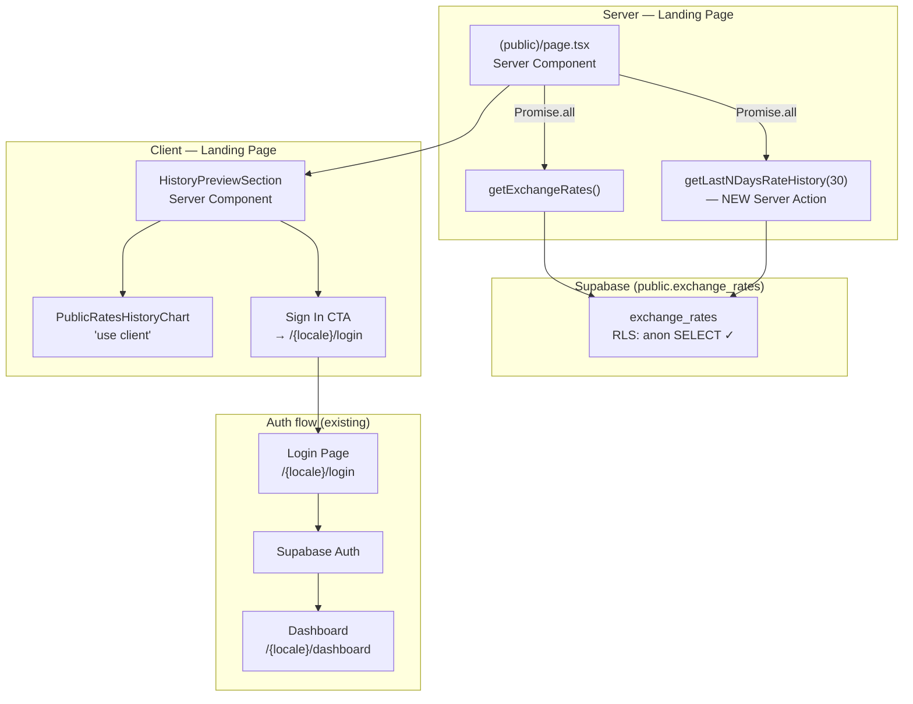
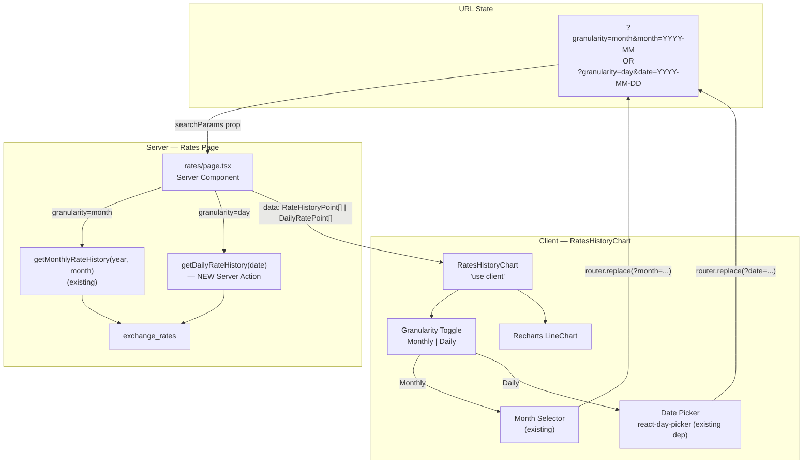
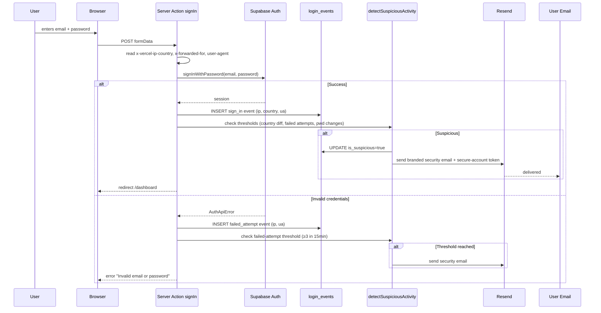
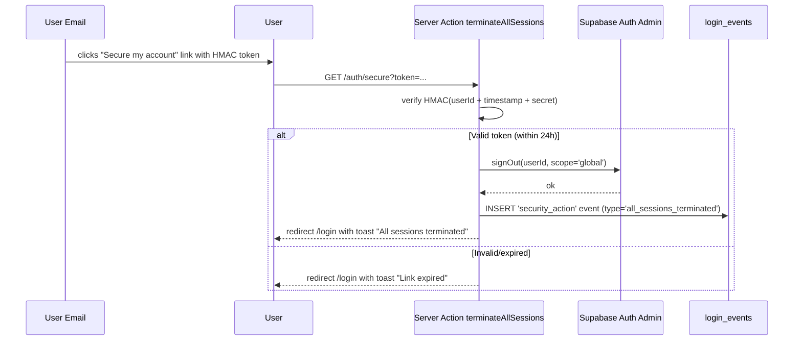
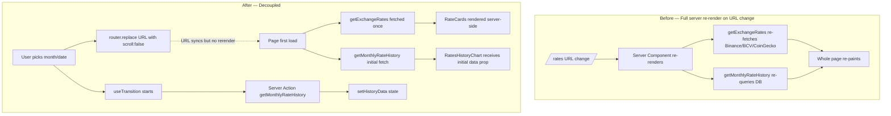
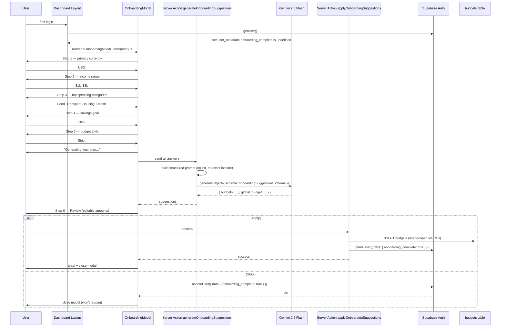
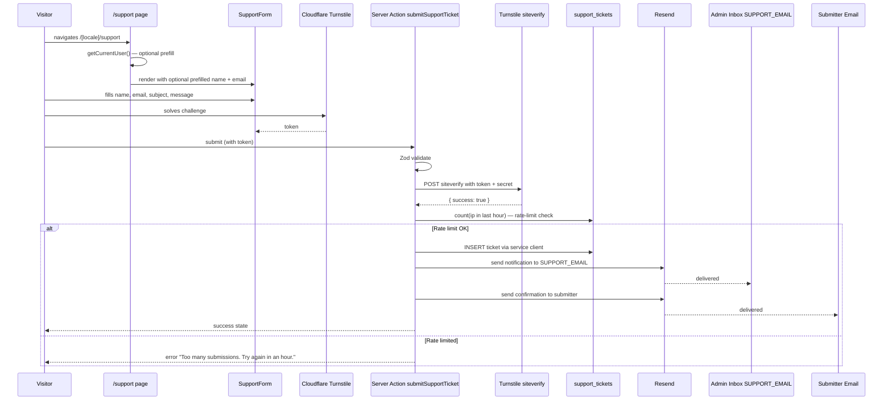

# Phase 3 — Architecture Deltas

One section per change. Only what actually changes architecturally — not a full system description.

---

## Change 1 — Logo → Home

**Delta:** Minimal. Three `<Link>` wrappers added to existing components. No new files, no state, no data flow change.

- `public/header.tsx`: swaps `next/link` for `@/i18n/navigation` Link (auto-localizes href).
- `layout/sidebar.tsx`: wraps the existing `<Isotipo>` in a Link pointing to `/dashboard`.
- `layout/header.tsx`: same as sidebar.

No diagram needed — pure component-level change with no data or boundary implications.

---

## Change 2 — Inline Bidirectional Editing

**Delta:** Internal state refactor inside one client component. No new files, no server action changes, no component boundary changes.

```
Before:
  amount (string) ──►  useEffect([amount, currency, direction]) ──► result (number)
  direction (toggle)
  [result field is readOnly]

After:
  fromAmount (string) ──► handleFromChange() ──► sets toAmount directly
  toAmount (string)   ──► handleToChange()   ──► sets fromAmount directly
  direction (toggle)  ──► useEffect([direction, currency]) recomputes toAmount from fromAmount
  [both fields are editable; no circular useEffect chain]
```

The `useEffect` is narrowed to only fire on `direction` or `currency` change — it is never triggered by the field change handlers themselves, eliminating the circular dependency risk.

---

## Change 3 — EUR Line in Rate History Chart

**Delta:** Type extension + one additional DB column in the query result + one additional Recharts `<Line>`. The data flow is unchanged.

```
Before:
  getMonthlyRateHistory() → RateHistoryPoint { date, usd, usdt }
                         → RatesHistoryChart → 2 Lines (USD, USDT)

After:
  getMonthlyRateHistory() → RateHistoryPoint { date, usd, usdt, eur }
                         → RatesHistoryChart → 3 Lines (USD, USDT, EUR)
```

The `exchange_rates` table already contains `EUR_VES` rows. Only the query filter and TypeScript type change.

---

## Change 4 — Public History Preview + Signup CTA

This is the most architecturally significant landing page addition.

### Data flow diagram



### Key architectural decisions

1. **Separate component from the authenticated chart.** `PublicRatesHistoryChart` is a new file, not a mode-flag in `RatesHistoryChart`. Reason: the public chart has no controls (no month selector, no mode toggle), and keeping the authenticated chart clean avoids conditional complexity. They share the `RateHistoryPoint` type but nothing else.

2. **Server Component wrapper.** `HistoryPreviewSection` is a Server Component that receives `data: RateHistoryPoint[]` from the page and passes it to `PublicRatesHistoryChart` (client). The Sign In CTA is rendered server-side as a plain `<Link>`.

3. **Parallel data fetching.** `getLastNDaysRateHistory(30)` runs in `Promise.all` alongside `getExchangeRates()` in the landing page — no sequential waterfall.

4. **No auth check in the new action.** `getLastNDaysRateHistory` uses `createClient()` (anon session OK — RLS allows anon `SELECT`). It does not call `requireUser()`.

---

## Change 5 — Daily (Intraday) Granularity

### Data flow diagram



### Key architectural decisions

1. **Two separate server actions, not one unified action.** Monthly and daily queries are structurally different (date-range vs. calendar-day, different aggregation). A single action with a mode flag would be harder to maintain.

2. **URL as the source of truth.** The server page reads `searchParams`, decides which action to call, and passes typed data down. The client component only handles UI interaction and URL updates — it does not call server actions directly. This keeps the data-fetching server-side and SSR-compatible.

3. **Type divergence.** Monthly data is `RateHistoryPoint[]` (one point per calendar day, `date: YYYY-MM-DD`). Daily data is `DailyRatePoint[]` (one point per DB record, `time: HH:mm`). The chart renders both but with different X-axis formatters.

4. **New DB index.** A composite index on `(pair, fetched_at DESC)` is required before deploying this change to avoid full table scans on daily queries.

---

## Change 6 — Shareable Rates Image

### Generation pipeline diagram

```mermaid
flowchart TD
    subgraph "Rates Page — /rates"
        RD["RatesData (prop)\nfrom Server""]
        SRB["ShareRatesButton\n'use client'"]
        DLG["ShareRatesDialog\n(Dialog + form state)"]
        TMPL["ShareRatesImageTemplate\nhidden div — off-screen DOM"]
        REF["React ref → DOM node"]
    end

    subgraph "User interaction"
        U1["1. Click 'Share Rates'"]
        U2["2. Select pairs (checkboxes)"]
        U3["3. Select platform"]
        U4["4. Click 'Generate & Share'"]
    end

    subgraph "Generation"
        LAZY["Lazy import('html-to-image')"]
        PNG["toPng(ref.current, { width, height })"]
        BLOB["PNG Blob → File"]
    end

    subgraph "Output"
        SHARE{"navigator.share\nsupports files?"}
        NS["Native Share Sheet\n(WhatsApp, etc.)"]
        DL["<a download> fallback\nrates-YYYY-MM-DD.png"]
    end

    RD --> SRB
    SRB --> DLG
    DLG --> TMPL
    TMPL --> REF

    U1 --> DLG
    U2 --> DLG
    U3 --> DLG
    U4 --> LAZY
    LAZY --> PNG
    REF --> PNG
    PNG --> BLOB
    BLOB --> SHARE
    SHARE -- Yes --> NS
    SHARE -- No --> DL
```

### Key architectural decisions

1. **Hidden template div is always mounted.** The `ShareRatesImageTemplate` renders into the DOM (with `position: absolute; left: -9999px; top: -9999px; overflow: hidden`) so that CSS is fully computed before capture. Mounting/unmounting on dialog open would delay CSS computation and risk capture failures.

2. **Template receives computed dimensions.** The platform selection updates a `{ width, height }` pair passed as props to the template (e.g., `{ width: 800, height: 800 }` for square). The template's root div has these as inline `style` attributes — `html-to-image` uses computed style, so the div must actually have these pixel dimensions applied.

3. **Lazy import minimizes bundle impact.** `html-to-image` (~30KB gzip) is never in the initial bundle. It is imported only when the user clicks "Generate & Share" — a natural moment to tolerate a 100–200ms network fetch on first use.

4. **SVG logo strategy.** Using a raw `` inside the template risks CORS issues in `html-to-image`'s internal `canvas.toDataURL()`. Mitigation: fetch the SVG as text at component mount time (`useEffect → fetch('/isologo.svg') → setLogoDataUrl(svgToDataUri(text))`), then render it as ``. This keeps the logo inline without adding a build step.

5. **No server round-trip.** All rate data is already available in the `RateData[]` prop passed from the server page. The image captures what the user sees — it is always consistent with the on-screen display.

---
---

# Phase 3 — Architecture Deltas (Batch 2: 13-Item Fix Batch)

> Per-item architectural deltas. Mermaid diagrams for the four substantial flows (#4, #10, #11, #12).

---

## #1 — Email Branding

**Delta:** Configuration + assets only. No new component or runtime architecture.

```
Before:
  Supabase Auth ──► Supabase built-in SMTP ──► generic Supabase template ──► user inbox
  alert-email.ts ──► Resend (sandbox onboarding@resend.dev) ──► developer inbox

After:
  Supabase Auth ──► Resend SMTP ──► fin@zergcore.dev ──► branded HTML template ──► user inbox
  alert-email.ts ──► Resend (fin@zergcore.dev) ──► developer inbox
```

The change is in `supabase/config.toml` (SMTP block + template paths) and the addition of `supabase/templates/*.html` files. No app code touches the auth email path — Supabase renders templates server-side using its own engine.

---

## #2 — Password-Reset Rate Limiting

**Delta:** Replace the library `<Auth view="forgotten_password">` UI with a custom form on the forgot-password page. Server-side enforcement remains in Supabase (`max_frequency = "60s"`); the client adds a 60s countdown for UX.

```
Before:
  <Auth view="forgotten_password"> ──► Supabase JS SDK ──► resetPasswordForEmail()
  [No cooldown UI; rapid resends silently succeed up to Supabase's hourly cap]

After:
  Custom form ──► useActionState(resetPassword) ──► Server Action
  Server Action ──► supabase.auth.resetPasswordForEmail()
                   └─► Supabase enforces max_frequency = 60s
  On success: client sets cooldown=60, button disabled, countdown decrements
```

No new component boundary or data flow. Just swapping the library form for a Server-Action-driven form.

---

## #3 — Duplicate "Forgot Password" Link

**Delta:** One prop change on `<Auth>` in the login page. No architectural impact.

---

## #4 — Suspicious-Activity Emails

**Delta:** Major. Replaces client-side `<Auth>` sign-in with a Server Action wrapped sign-in flow. Adds a new DB table (`login_events`), a new heuristics module (`src/lib/suspicious-activity.ts`), and a new branded email template.

### Sign-in flow (sequence diagram)



### "This wasn't me" flow



### Architectural decisions

1. **Sign-in goes through a Server Action, not Auth UI.** Required for server-side access to `x-vercel-ip-country` and IP. Auth UI runs client-side and cannot read these headers.
2. **`login_events` is INSERT-only via service client.** RLS allows users SELECT on their own rows. Insertions use `createServiceClient()` because the user's session may not exist yet (failed attempts).
3. **Heuristics are stateless against `login_events`.** `detectSuspiciousActivity(userId, currentEvent)` queries the table for thresholds — no in-memory cache. Simple, durable, observable in DB.
4. **Email link uses HMAC, not DB token.** A signed URL `?token=base64(userId.timestamp.hmac)` avoids needing a separate `session_terminate_tokens` table. Validity window: 24h.

---

## #5 — OWASP Compliance

**Delta:** `next.config.ts` gains a `headers()` export. `supabase/config.toml` tightens password policy. New migration adds missing RLS policies. `.env.example` updated. Cookie flags added in middleware.

No runtime architecture change — this is pure hardening of existing surfaces.

---

## #6 — Avatar Not Rendering

**Delta:** One component, one element added. No architectural impact.

---

## #7 — Budget Circle Clipped

**Delta:** CSS scope refactor — move `overflow-hidden` from the Card root to a child div that holds only the gradient accent. No architectural impact.

---

## #8 — Expenses Redesign

**Delta:** Layout reorganization in the expenses page. The previously-orphaned `ExpensesSidebar` is wired into the page in a 2-column grid on desktop. KPI hierarchy is restructured (one dominant card + three secondary). Empty state component is introduced.

```
Before:
  ExpensesPage
  ├── Title + Actions
  ├── MonthSelector
  ├── KPIHeader (4 uniform cards, only if budget > 0)
  └── ExpensesClient → DataTable
       └── Footer: 8 stacked numbers

After (lg+):
  ExpensesPage
  ├── Title + Actions
  ├── MonthSelector
  └── grid-cols-[1fr_300px]
      ├── Main column
      │    ├── KPIHeader (1 dominant + 3 secondary)
      │    ├── DataTable (with redesigned empty state)
      │    └── Footer: USD prominent, others muted
      └── Aside (ExpensesSidebar)
           ├── ChartCard (donut) — overflow fixed
           ├── DailySpendingInsight
           └── Projected Spending
```

---

## #9 — Money-Conversion Library

**Delta:** Internal refactor of `currency-calculator.ts` and rate parsing in `rates.ts`. No public API change to the modules — `calculateEquivalents`, `sumByEquivalent`, `buildRatesSnapshot` keep their signatures. Internal types may use Dinero objects, but exposed types remain plain numbers (Dinero converted to number at boundary).

```
Before:
  parseFloat(row.rate) ──► JS number ──► float arithmetic ──► JS number
                                       (drift: 0.1 + 0.2 ≠ 0.3)

After:
  row.rate (string) ──► parse to integer + scale ──► dinero({ amount, currency, scale })
                                                  ──► add/multiply/convert via Dinero
                                                  ──► toUnit() at display boundary ──► JS number
```

The boundary between Dinero (internal, exact) and `number` (display, JS-native) is the function return values. Only the display step loses precision — and only down to the configured rounding (e.g., banker's rounding to 2 decimal places).

---

## #10 — Monthly Rates Async

**Delta:** History chart becomes self-fetching. Live rate cards stay server-rendered. URL still updates for shareability but no longer triggers a full server re-render.



### Architectural decisions

1. **Initial render still server-side.** SEO + first-paint stay fast. Only navigation interactions become client-side.
2. **`useTransition` over SWR.** Native React 19 primitive. No new dependency. Provides built-in `isPending` for the loading UI.
3. **URL stays in sync.** `router.replace` with `{ scroll: false }` preserves shareable links. Direct hits to `/rates?granularity=day&date=2026-05-06` still work — server reads search params on first load.
4. **No client-side cache.** Each navigation re-fetches. Acceptable for low-traffic chart navigation. Add SWR/React Query only if observed perf becomes an issue.

---

## #11 — Onboarding AI Assistant

**Delta:** New modal component injected into the dashboard layout, conditionally rendered on first login. New onboarding actions module. AI integration via existing `@ai-sdk/google`. Writes to existing `budgets` table.

### Onboarding flow (sequence diagram)



### Architectural decisions

1. **Modal lives at layout level, not page level.** Renders before any page logic, ensuring it appears on whichever dashboard route the user lands on.
2. **AI call is a single round-trip at end of wizard.** No progressive AI calls between steps — user explicitly asked for step-wizard with one AI call.
3. **Gemini structured output via Zod.** Eliminates parse failures; the SDK retries until the schema is satisfied.
4. **No new DB table.** `onboarding_complete` flag lives in `user_metadata` (Supabase Auth handles persistence). Budgets go in the existing `budgets` table.
5. **PII guardrail.** Income range is bracketed, not exact. Categories and currencies are non-PII. Wizard answers never include free-text user input that could be a prompt-injection vector.

---

## #12 — Contact/Support Section

**Delta:** New public route, new form component, new Server Action, new DB table, new email pipeline. All additive.

### Support intake flow (sequence diagram)



### Architectural decisions

1. **Public-accessible route.** `(public)` segment, not `(dashboard)`. No `requireUser()` gate.
2. **Auth-aware prefill, not auth requirement.** Server Component reads `getCurrentUser()` for prefill values; logged-out visitors see an empty form.
3. **Service-client INSERT.** Anonymous visitors don't have an authenticated session. Server Action uses `createServiceClient()` to insert the row.
4. **Rate limit via DB count, not Redis.** `SELECT COUNT(*) FROM support_tickets WHERE ip_address = ? AND created_at > NOW() - INTERVAL '1 hour'`. No new infrastructure required.
5. **Two emails per submission.** Admin notification (with user's content) + submitter confirmation (with their submission summary). Both via Resend, both branded.

---

## #13 — Git Convention

No architectural delta. Documentation-only addition to `CLAUDE.md`.
