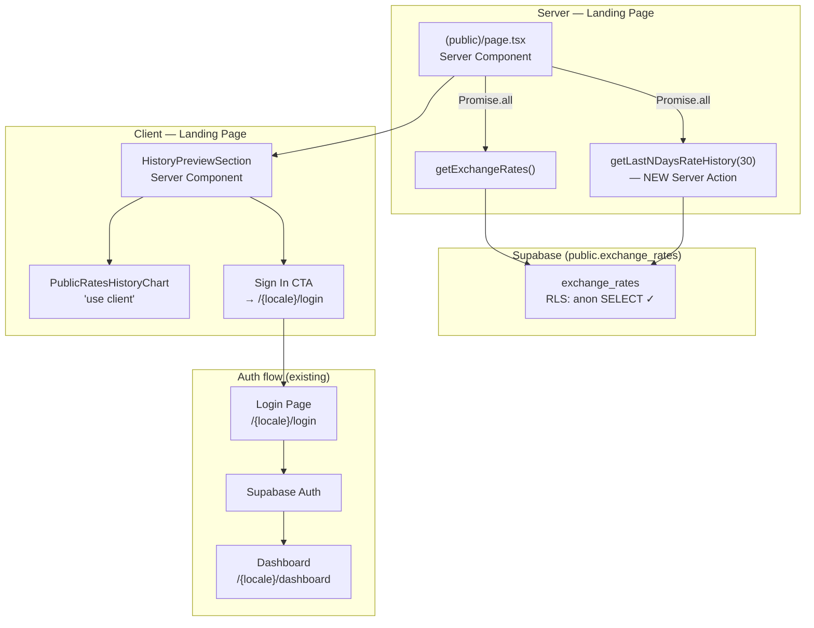
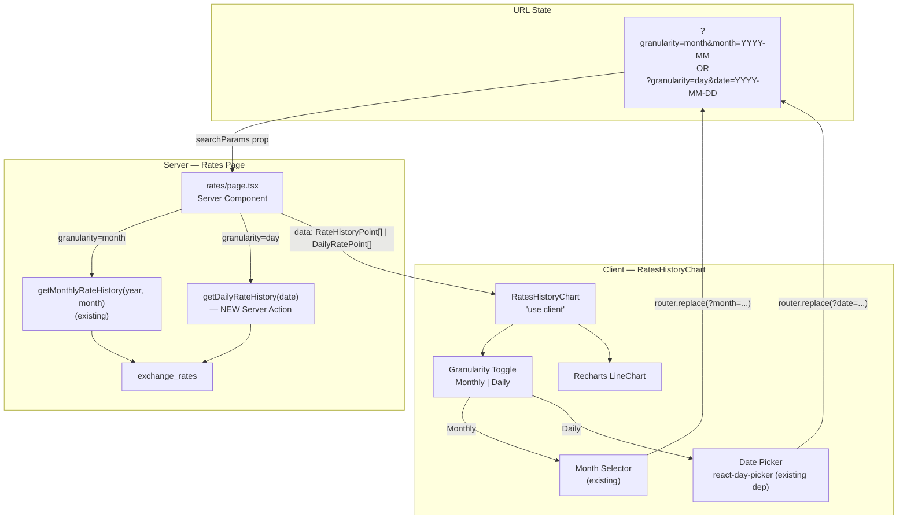

# Phase 3 — Architecture Deltas

One section per change. Only what actually changes architecturally — not a full system description.

---

## Change 1 — Logo → Home

**Delta:** Minimal. Three `<Link>` wrappers added to existing components. No new files, no state, no data flow change.

- `public/header.tsx`: swaps `next/link` for `@/i18n/navigation` Link (auto-localizes href).
- `layout/sidebar.tsx`: wraps the existing `<Isotipo>` in a Link pointing to `/dashboard`.
- `layout/header.tsx`: same as sidebar.

No diagram needed — pure component-level change with no data or boundary implications.

---

## Change 2 — Inline Bidirectional Editing

**Delta:** Internal state refactor inside one client component. No new files, no server action changes, no component boundary changes.

```
Before:
  amount (string) ──►  useEffect([amount, currency, direction]) ──► result (number)
  direction (toggle)
  [result field is readOnly]

After:
  fromAmount (string) ──► handleFromChange() ──► sets toAmount directly
  toAmount (string)   ──► handleToChange()   ──► sets fromAmount directly
  direction (toggle)  ──► useEffect([direction, currency]) recomputes toAmount from fromAmount
  [both fields are editable; no circular useEffect chain]
```

The `useEffect` is narrowed to only fire on `direction` or `currency` change — it is never triggered by the field change handlers themselves, eliminating the circular dependency risk.

---

## Change 3 — EUR Line in Rate History Chart

**Delta:** Type extension + one additional DB column in the query result + one additional Recharts `<Line>`. The data flow is unchanged.

```
Before:
  getMonthlyRateHistory() → RateHistoryPoint { date, usd, usdt }
                         → RatesHistoryChart → 2 Lines (USD, USDT)

After:
  getMonthlyRateHistory() → RateHistoryPoint { date, usd, usdt, eur }
                         → RatesHistoryChart → 3 Lines (USD, USDT, EUR)
```

The `exchange_rates` table already contains `EUR_VES` rows. Only the query filter and TypeScript type change.

---

## Change 4 — Public History Preview + Signup CTA

This is the most architecturally significant landing page addition.

### Data flow diagram



### Key architectural decisions

1. **Separate component from the authenticated chart.** `PublicRatesHistoryChart` is a new file, not a mode-flag in `RatesHistoryChart`. Reason: the public chart has no controls (no month selector, no mode toggle), and keeping the authenticated chart clean avoids conditional complexity. They share the `RateHistoryPoint` type but nothing else.

2. **Server Component wrapper.** `HistoryPreviewSection` is a Server Component that receives `data: RateHistoryPoint[]` from the page and passes it to `PublicRatesHistoryChart` (client). The Sign In CTA is rendered server-side as a plain `<Link>`.

3. **Parallel data fetching.** `getLastNDaysRateHistory(30)` runs in `Promise.all` alongside `getExchangeRates()` in the landing page — no sequential waterfall.

4. **No auth check in the new action.** `getLastNDaysRateHistory` uses `createClient()` (anon session OK — RLS allows anon `SELECT`). It does not call `requireUser()`.

---

## Change 5 — Daily (Intraday) Granularity

### Data flow diagram



### Key architectural decisions

1. **Two separate server actions, not one unified action.** Monthly and daily queries are structurally different (date-range vs. calendar-day, different aggregation). A single action with a mode flag would be harder to maintain.

2. **URL as the source of truth.** The server page reads `searchParams`, decides which action to call, and passes typed data down. The client component only handles UI interaction and URL updates — it does not call server actions directly. This keeps the data-fetching server-side and SSR-compatible.

3. **Type divergence.** Monthly data is `RateHistoryPoint[]` (one point per calendar day, `date: YYYY-MM-DD`). Daily data is `DailyRatePoint[]` (one point per DB record, `time: HH:mm`). The chart renders both but with different X-axis formatters.

4. **New DB index.** A composite index on `(pair, fetched_at DESC)` is required before deploying this change to avoid full table scans on daily queries.

---

## Change 6 — Shareable Rates Image

### Generation pipeline diagram

```mermaid
flowchart TD
    subgraph "Rates Page — /rates"
        RD["RatesData (prop)\nfrom Server""]
        SRB["ShareRatesButton\n'use client'"]
        DLG["ShareRatesDialog\n(Dialog + form state)"]
        TMPL["ShareRatesImageTemplate\nhidden div — off-screen DOM"]
        REF["React ref → DOM node"]
    end

    subgraph "User interaction"
        U1["1. Click 'Share Rates'"]
        U2["2. Select pairs (checkboxes)"]
        U3["3. Select platform"]
        U4["4. Click 'Generate & Share'"]
    end

    subgraph "Generation"
        LAZY["Lazy import('html-to-image')"]
        PNG["toPng(ref.current, { width, height })"]
        BLOB["PNG Blob → File"]
    end

    subgraph "Output"
        SHARE{"navigator.share\nsupports files?"}
        NS["Native Share Sheet\n(WhatsApp, etc.)"]
        DL["<a download> fallback\nrates-YYYY-MM-DD.png"]
    end

    RD --> SRB
    SRB --> DLG
    DLG --> TMPL
    TMPL --> REF

    U1 --> DLG
    U2 --> DLG
    U3 --> DLG
    U4 --> LAZY
    LAZY --> PNG
    REF --> PNG
    PNG --> BLOB
    BLOB --> SHARE
    SHARE -- Yes --> NS
    SHARE -- No --> DL
```

### Key architectural decisions

1. **Hidden template div is always mounted.** The `ShareRatesImageTemplate` renders into the DOM (with `position: absolute; left: -9999px; top: -9999px; overflow: hidden`) so that CSS is fully computed before capture. Mounting/unmounting on dialog open would delay CSS computation and risk capture failures.

2. **Template receives computed dimensions.** The platform selection updates a `{ width, height }` pair passed as props to the template (e.g., `{ width: 800, height: 800 }` for square). The template's root div has these as inline `style` attributes — `html-to-image` uses computed style, so the div must actually have these pixel dimensions applied.

3. **Lazy import minimizes bundle impact.** `html-to-image` (~30KB gzip) is never in the initial bundle. It is imported only when the user clicks "Generate & Share" — a natural moment to tolerate a 100–200ms network fetch on first use.

4. **SVG logo strategy.** Using a raw `` inside the template risks CORS issues in `html-to-image`'s internal `canvas.toDataURL()`. Mitigation: fetch the SVG as text at component mount time (`useEffect → fetch('/isologo.svg') → setLogoDataUrl(svgToDataUri(text))`), then render it as ``. This keeps the logo inline without adding a build step.

5. **No server round-trip.** All rate data is already available in the `RateData[]` prop passed from the server page. The image captures what the user sees — it is always consistent with the on-screen display.
