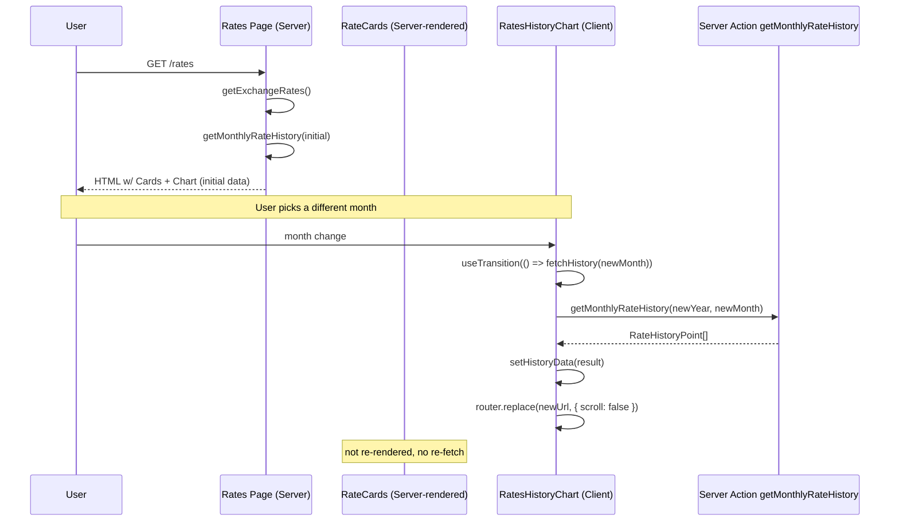

# Phase 3 — Rates Async (Batch 2)

> Item #10. Decouple history-chart navigation from full-page server re-render. Live rate cards stay server-rendered (cached). History chart becomes self-fetching via `useTransition` + Server Actions.

---

## 1. Current Coupling Diagnosis

`src/app/[locale]/(dashboard)/rates/page.tsx` is a Server Component that reads `searchParams` and calls **both** `getExchangeRates()` (live cards) **and** `getMonthlyRateHistory(year, month)` (history chart) on every request.

When the user clicks a different month in the chart's month selector:
1. `RatesHistoryChart` updates the URL via `router.push` or `router.replace`.
2. Next.js triggers a server re-render of the rates page (the URL changed).
3. The page Server Component runs again — calls `getExchangeRates()` AND `getMonthlyRateHistory(...)`.
4. `getExchangeRates()` re-runs even though the live rates haven't changed. It checks Supabase first (cached), then potentially fetches fresh data from Binance/BCV/CoinGecko if cached values are older than `staleMin`.

Even with `next: { revalidate: 300 }` on the `fetch()` calls, the cost includes:
- The Server Component round-trip (cold-start latency on serverless).
- A Supabase query for cached rates.
- Conditionally, external API calls.
- Re-render of the entire page tree (rate cards, title, share button).

For a UX action that should only update one component (the chart), this is wasteful.

---

## 2. Target Architecture



---

## 3. Implementation Sketch

### `src/components/rates/rates-history-chart.tsx`

```tsx
"use client";

import { useState, useTransition } from "react";
import { useRouter } from "@/i18n/navigation";
import { getMonthlyRateHistory, getDailyRateHistory, type RateHistoryPoint, type DailyRatePoint } from "@/actions/rates";

interface Props {
  initialData: RateHistoryPoint[] | DailyRatePoint[];
  initialGranularity: "month" | "day";
  initialMonth: { year: number; month: number };
  initialDate: string; // YYYY-MM-DD
}

export function RatesHistoryChart({ initialData, initialGranularity, initialMonth, initialDate }: Props) {
  const router = useRouter();
  const [granularity, setGranularity] = useState(initialGranularity);
  const [data, setData] = useState(initialData);
  const [selectedMonth, setSelectedMonth] = useState(initialMonth);
  const [selectedDate, setSelectedDate] = useState(initialDate);
  const [isPending, startTransition] = useTransition();

  const handleMonthChange = (year: number, month: number) => {
    setSelectedMonth({ year, month });
    startTransition(async () => {
      const result = await getMonthlyRateHistory(year, month);
      setData(result);
    });
    router.replace(`/rates?granularity=month&month=${year}-${String(month).padStart(2, "0")}`, { scroll: false });
  };

  const handleDateChange = (date: string) => {
    setSelectedDate(date);
    startTransition(async () => {
      const result = await getDailyRateHistory(date);
      setData(result);
    });
    router.replace(`/rates?granularity=day&date=${date}`, { scroll: false });
  };

  const handleGranularityChange = (next: "month" | "day") => {
    setGranularity(next);
    startTransition(async () => {
      if (next === "month") {
        const result = await getMonthlyRateHistory(selectedMonth.year, selectedMonth.month);
        setData(result);
        router.replace(`/rates?granularity=month&month=${selectedMonth.year}-${String(selectedMonth.month).padStart(2, "0")}`, { scroll: false });
      } else {
        const result = await getDailyRateHistory(selectedDate);
        setData(result);
        router.replace(`/rates?granularity=day&date=${selectedDate}`, { scroll: false });
      }
    });
  };

  return (
    <Card>
      <GranularityToggle value={granularity} onChange={handleGranularityChange} disabled={isPending} />
      {granularity === "month" ? (
        <MonthSelector value={selectedMonth} onChange={handleMonthChange} disabled={isPending} />
      ) : (
        <DatePicker value={selectedDate} onChange={handleDateChange} disabled={isPending} />
      )}
      <div className={isPending ? "opacity-50 transition-opacity" : ""}>
        {/* Recharts LineChart, fed by `data` */}
      </div>
    </Card>
  );
}
```

### `src/app/[locale]/(dashboard)/rates/page.tsx`

```tsx
export default async function RatesPage({ searchParams }: RatesPageProps) {
  await requireUser();
  const resolved = await searchParams;
  const granularity = resolved?.granularity === "day" ? "day" : "month";

  // Resolve initial month/date as before
  const { year, month, dateStr } = resolveSearchParams(resolved);

  // Fetch live rates ONCE (server) and initial history data (server)
  const [rates, initialHistory] = await Promise.all([
    getExchangeRates(),
    granularity === "day" ? getDailyRateHistory(dateStr) : getMonthlyRateHistory(year, month),
  ]);

  return (
    <div className="space-y-6">
      <RatesTitle><ShareRatesButton rates={rates} /></RatesTitle>
      <div className="grid gap-3 sm:gap-4 grid-cols-1 md:grid-cols-2 lg:grid-cols-3">
        {rates.map((r, i) => <RateCard key={i} {...r} />)}
      </div>
      <RatesHistoryChart
        initialData={initialHistory}
        initialGranularity={granularity}
        initialMonth={{ year, month }}
        initialDate={dateStr}
      />
    </div>
  );
}
```

---

## 4. Stale-While-Revalidate Strategy

**Live rate cards** (`getExchangeRates`):
- Already use `next: { revalidate: 300 }` on Binance, `revalidate: 3600` on BCV/Frankfurter, `revalidate: 600` on CoinGecko.
- Plus a Supabase-DB cache layer keyed by `pair + source` and a `staleMin` threshold per pair.
- After this change, the Server Component runs `getExchangeRates` only on full-page navigation — the existing caching is sufficient.

**History data** (`getMonthlyRateHistory`, `getDailyRateHistory`):
- DB queries against `exchange_rates` table — fast.
- Could add a 60-second SWR cache via `unstable_cache` (Next.js) keyed by `(year, month)` or `date`. Optional; defer until measured.

**Fallback when rates unavailable:**
- If `getExchangeRates` returns an empty array (all sources down), the rate cards section renders empty. Mitigation: show last-known-good rate from the DB fallback (already implemented in `getVal` helper that falls back to cached values).
- For the chart: if history data is empty, render a "No data for this period" state.

---

## 5. URL Behavior

- Initial page load reads search params and renders server-side with the requested data — direct links and shareable URLs work.
- Navigation within the chart updates the URL via `router.replace({ scroll: false })` — back-button behavior preserved (URL state restored on history navigation; the chart re-renders from URL on history pop because of the initial-render path).
- **[ASSUMPTION]** Browser back button after a transition will trigger a server re-render of the page (`router.replace` updates history but doesn't bypass server fetching on pop). Acceptable — back-button is an infrequent action.

---

## 6. Acceptance Criteria

- [ ] First load `/rates` server-renders both rate cards and history chart with correct data.
- [ ] Selecting a different month does **not** cause the rate cards to flicker or refetch (verify in DevTools Network tab — no new Binance/BCV requests).
- [ ] Chart updates within ~500ms of month change.
- [ ] URL updates to reflect month, but no full page reload occurs.
- [ ] Direct navigation to `/rates?granularity=day&date=2026-05-06` server-renders the daily view correctly.
- [ ] Back/forward browser buttons restore the chart state from URL.
- [ ] Chart shows a subtle loading state during the transition (`isPending`).

---

## 7. Risks & Mitigations

| Risk | Mitigation |
|---|---|
| Server Action returns slow → user sees stale chart for several seconds | `isPending` state visualizes the transition; opacity-50 on chart conveys loading |
| Server Action errors (DB unavailable) | Try/catch in `startTransition` callback → toast error; chart keeps prior data |
| `router.replace({ scroll: false })` doesn't update URL synchronously with state | Acceptable — URL syncs ~10ms later; user-perceptible delta is zero |
| User shares URL during a pending transition | URL reflects the *target* month (set via `router.replace` after `setData`); shared link will re-fetch correctly on the recipient's first load |

---

## 8. Effort & Risk

- **Effort:** ~4 hours.
- **Risk:** Low. Localized to two files. Server-side rendering paths unchanged.
- **Rollback:** Revert `rates-history-chart.tsx` to URL-driven rendering.
